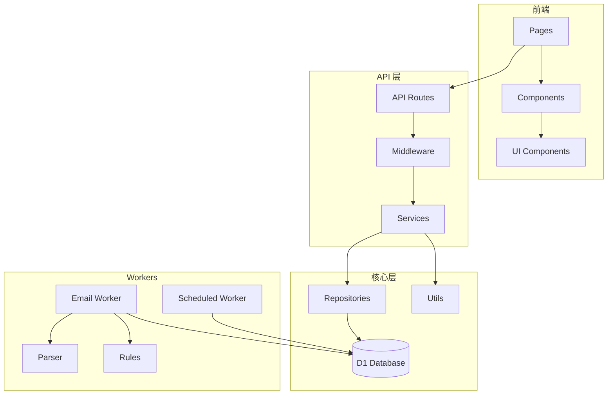

# AGENTS.md - FlashInbox AI 开发指南

> 本文档为 AI 代理（如 Cursor、Copilot）提供项目上下文和开发规范。

---

## 1. 项目概述 (Project Overview)

### 1.1 项目目的

**FlashInbox / 闪收箱** 是一个基于 Cloudflare Serverless 的临时邮箱服务，允许用户：
- 无需注册即可生成临时邮箱
- 接收邮件（不含附件）
- 通过 Key 恢复访问（15 天有效期）

### 1.2 技术栈

| 层级 | 技术 |
|------|------|
| 前端框架 | Next.js 14+ (App Router, Edge Runtime) |
| 用户端 UI | MDUI 2（严格 MD3） |
| 管理端 UI | TailAdmin + shadcn/ui（Tailwind 体系） |
| 样式 | Tailwind CSS |
| 图标 | Iconify（用户端 `mdi` / 管理端 `lucide`） |
| 运行时 | Cloudflare Workers |
| 数据库 | Cloudflare D1 (SQLite) |
| 邮件接收 | Cloudflare Email Routing + Email Workers |
| 人机验证 | Cloudflare Turnstile |
| 部署适配 | OpenNext |
| 包管理 | **bun** (禁止使用 npm/pnpm/yarn) |

### 1.3 关键功能

1. **邮箱创建**: 随机生成或手动指定用户名
2. **邮件接收**: Email Worker 处理入站邮件
3. **认领系统**: 未认领邮箱需要 Claim 获取 Key
4. **恢复访问**: username + key 恢复
5. **管理后台**: 域名、规则、隔离队列管理

### 1.4 相关文档

- `@spec/01spec.md` - 需求规格说明
- `@spec/02design.md` - 系统设计文档
- `@spec/03task.md` - 开发任务清单

### 1.5 用户端语言支持

- 当前支持 `en-US`、`zh-CN`、`zh-TW`、`fr-FR`、`de-DE`、`es-ES`、`ja-JP`

---

## 2. 架构/文件结构 (Architecture/Project Map)

### 2.1 目录结构

```
flashinbox/
├── src/
│   ├── app/                    # Next.js App Router
│   │   ├── (user)/             # 用户端路由组
│   │   │   ├── page.tsx        # 首页 (/)
│   │   │   ├── inbox/          # 收件箱 (/inbox)
│   │   │   ├── claim/          # 认领页 (/claim)
│   │   │   └── recover/        # 恢复页 (/recover)
│   │   ├── (admin)/            # 管理端路由组
│   │   │   └── admin/          # 管理后台 (/admin/*)
│   │   ├── api/                # API 路由
│   │   │   ├── user/           # 用户 API
│   │   │   │   ├── create/
│   │   │   │   ├── claim/
│   │   │   │   ├── recover/
│   │   │   │   └── renew/
│   │   │   ├── mailbox/        # 邮箱 API
│   │   │   │   ├── info/
│   │   │   │   ├── inbox/
│   │   │   │   └── message/
│   │   │   └── admin/          # 管理 API
│   │   │       ├── login/
│   │   │       ├── domains/
│   │   │       ├── rules/
│   │   │       ├── quarantine/
│   │   │       ├── audit/
│   │   │       └── dashboard/
│   │   ├── layout.tsx          # 根布局
│   │   └── globals.css         # 全局样式
│   │
│   ├── components/             # React 组件
│   │   ├── ui/                 # 通用 UI 组件
│   │   │   ├── Button.tsx
│   │   │   ├── TextField.tsx
│   │   │   ├── Dialog.tsx
│   │   │   └── Turnstile.tsx
│   │   ├── layout/             # 布局组件
│   │   │   ├── Header.tsx
│   │   │   ├── Sidebar.tsx
│   │   │   └── Footer.tsx
│   │   ├── mail/               # 邮件相关组件
│   │   │   ├── MailList.tsx
│   │   │   ├── MailDetail.tsx
│   │   │   └── HtmlViewer.tsx
│   │   └── admin/              # 管理后台组件
│   │       ├── StatsCard.tsx
│   │       ├── DataTable.tsx
│   │       └── Chart.tsx
│   │
│   ├── lib/                    # 核心库
│   │   ├── db/                 # 数据库层
│   │   │   ├── repository.ts   # Repository 基类
│   │   │   ├── mailbox-repo.ts
│   │   │   ├── message-repo.ts
│   │   │   ├── domain-repo.ts
│   │   │   └── ...
│   │   ├── services/           # 业务服务
│   │   │   ├── mailbox.ts
│   │   │   ├── message.ts
│   │   │   ├── rate-limit.ts
│   │   │   ├── turnstile.ts
│   │   │   ├── session.ts
│   │   │   └── admin-auth.ts
│   │   ├── utils/              # 工具函数
│   │   │   ├── crypto.ts       # hashKey, generateKey, timingSafeEqual
│   │   │   ├── username.ts     # generateRandomUsername, canonicalize
│   │   │   ├── response.ts     # success, error, ErrorCodes
│   │   │   └── sanitizer.ts    # HTML 净化
│   │   ├── middleware/         # 中间件
│   │   │   ├── auth.ts         # withAuth
│   │   │   └── admin-auth.ts   # withAdminAuth
│   │   ├── types/              # TypeScript 类型
│   │   │   ├── entities.ts     # 数据实体类型
│   │   │   ├── api.ts          # API 请求/响应类型
│   │   │   └── env.ts          # 环境变量类型
│   │   └── env.ts              # 配置加载
│   │
│   ├── workers/                # Cloudflare Workers
│   │   ├── email/              # Email Worker
│   │   │   ├── index.ts
│   │   │   ├── parser.ts
│   │   │   └── rules.ts
│   │   └── scheduled/          # Scheduled Worker
│   │       └── cleanup.ts
│   │
│   └── middleware.ts           # Next.js 中间件
│
├── migrations/                 # D1 数据库迁移
│   └── 0001_init.sql
│
├── public/                     # 静态资源
│
├── spec/                       # 项目文档
│   ├── 01spec.md               # 需求规格
│   ├── 02design.md             # 设计文档
│   └── 03task.md               # 任务清单
│
├── tests/                      # 测试文件
│   ├── unit/
│   └── integration/
│
├── wrangler.toml               # Cloudflare 主应用部署模板
├── next.config.js              # Next.js 配置
├── tailwind.config.js          # Tailwind 配置
├── tsconfig.json               # TypeScript 配置
├── package.json
├── bun.lockb                   # bun 锁文件
├── AGENTS.md                   # 本文件
└── README.md
```

### 2.2 关键模块关系



---

## 3. 构建/运行指令 (Build/Test/Run Scripts)

> **重要**: 本项目使用 **bun** 作为包管理器，禁止使用 npm/pnpm/yarn。

### 3.1 安装依赖

```bash
# 安装依赖
bun install

# 添加新依赖
bun add <package>

# 添加开发依赖
bun add -D <package>
```

### 3.2 开发

```bash
# 启动 Next.js 开发服务器
bun run dev

# 启动 Wrangler 本地开发（模拟 Workers 环境）
bun run dev:wrangler

# 同时启动（推荐）
bun run dev:all
```

### 3.3 数据库

```bash
# 从远程 D1 同步到本地 SQLite
bun run d1:sync-local

# 执行迁移（远程）
wrangler d1 execute flashinbox-db --remote --file=migrations/0001_init.sql
```

### 3.4 测试

```bash
# 运行所有测试
bun test

# 运行单元测试
bun test:unit

# 运行集成测试
bun test:integration

# 测试覆盖率
bun test:coverage
```

### 3.5 构建与部署

```bash
# 构建
bun run build

# 部署到 Cloudflare
bun run deploy

# 部署 Email Worker
wrangler deploy --config .tmp/wrangler.email.toml

# 设置 Secrets
wrangler secret put ADMIN_TOKEN
wrangler secret put KEY_PEPPER
wrangler secret put SESSION_SECRET
wrangler secret put TURNSTILE_SECRET_KEY
```

### 3.6 其他

```bash
# 类型检查
bun run typecheck

# Lint 检查
bun run lint

# 格式化代码
bun run format
```

---

## 4. 编码风格 (Code Style)

### 4.1 语言规范

- TypeScript 严格模式 (`strict: true`)
- 使用 ES2022+ 语法
- 优先使用 `const`，避免 `var`
- 使用 async/await，避免 .then() 链

### 4.2 命名约定

| 类型 | 规范 | 示例 |
|------|------|------|
| 文件名 | kebab-case | `mailbox-repo.ts` |
| 组件文件 | PascalCase | `MailList.tsx` |
| 变量/函数 | camelCase | `getMailbox()` |
| 类/类型/接口 | PascalCase | `MailboxService` |
| 常量 | UPPER_SNAKE_CASE | `ERROR_CODES` |
| 数据库字段 | snake_case | `key_expires_at` |
| CSS 类名 | kebab-case 或 Tailwind | `mail-list-item` |

### 4.3 格式化工具

- **Prettier** 用于代码格式化
- **ESLint** 用于代码质量检查
- 配置文件: `.prettierrc`, `.eslintrc.js`

```json
// .prettierrc
{
  "semi": true,
  "singleQuote": true,
  "tabWidth": 2,
  "trailingComma": "es5",
  "printWidth": 100
}
```

### 4.4 导入顺序

```typescript
// 1. Node.js 内置模块
import { createHash } from 'crypto';

// 2. 外部依赖
import { NextRequest } from 'next/server';
import DOMPurify from 'isomorphic-dompurify';

// 3. 内部模块 - 绝对路径
import { MailboxRepository } from '@/lib/db/mailbox-repo';
import { success, error } from '@/lib/utils/response';

// 4. 类型导入
import type { Mailbox } from '@/lib/types/entities';
```

### 4.5 组件编写规范

```typescript
// 1. 使用函数组件
// 2. Props 类型单独定义
// 3. 使用 Iconify 图标，禁止 emoji

import { Icon } from '@iconify/react';

interface ButtonProps {
  variant?: 'filled' | 'outlined';
  icon?: string;
  children: React.ReactNode;
  onClick?: () => void;
}

export function Button({ variant = 'filled', icon, children, onClick }: ButtonProps) {
  return (
    <mdui-button variant={variant} onClick={onClick}>
      {icon && <Icon icon={icon} slot="icon" />}
      {children}
    </mdui-button>
  );
}
```

---

## 5. 安全与守则 (Security and Guardrails)

### 5.1 禁止行为

| 禁止项 | 说明 |
|--------|------|
| **禁止使用 emoji** | 代码、UI、文档中均不得使用 emoji |
| **禁止其他包管理器** | 只能使用 bun，禁止 npm/pnpm/yarn |
| **禁止其他图标库** | 只能使用 Iconify，禁止 Font Awesome/Heroicons |
| **禁止内联 SVG** | 使用 Iconify 提供的图标 |
| **禁止明文存储 Key** | Key 必须经过 SHA-256 + pepper 哈希 |
| **禁止泄露敏感信息** | 错误响应不能区分"邮箱不存在"和"Key 错误" |
| **禁止 UI 框架混用** | 用户端只用 MDUI，管理端只用 TailAdmin + shadcn/ui |

### 5.2 安全实践

#### Key 验证

```typescript
// 必须使用恒定时间比较
import { timingSafeEqual } from '@/lib/utils/crypto';

const inputHash = await hashKey(inputKey, pepper);
const isValid = timingSafeEqual(inputHash, storedHash);
```

#### 错误响应

```typescript
// 正确：统一的错误消息
return error('INVALID_CREDENTIALS', 'Invalid credentials', 401);

// 错误：泄露信息
return error('MAILBOX_NOT_FOUND', 'Mailbox does not exist', 404);
```

#### HTML 净化

```typescript
// 所有用户输入的 HTML 必须净化
import { sanitizeHtml } from '@/lib/utils/sanitizer';

const cleanHtml = sanitizeHtml(dirtyHtml);
```

### 5.3 敏感配置

以下配置必须通过环境变量注入，禁止硬编码：

- `ADMIN_TOKEN` - 管理员令牌
- `KEY_PEPPER` - Key 哈希加盐
- `SESSION_SECRET` - 会话签名密钥
- `TURNSTILE_SECRET_KEY` - Turnstile 验证密钥

### 5.4 CSP 策略

用户站点和管理后台使用不同的 CSP：

```typescript
// 用户站点
"script-src 'self' https://challenges.cloudflare.com"

// 管理后台（更严格）
"script-src 'self'"
"frame-src 'none'"
```

---

## 6. 贡献指南 (Contribution Guidelines)

### 6.1 开发流程

1. 从 `main` 分支创建特性分支
2. 开发并测试
3. 提交 PR，等待 review
4. 合并到 `main`

### 6.2 分支命名

- `feature/<task-id>-<description>` - 新功能
- `fix/<issue-id>-<description>` - Bug 修复
- `refactor/<description>` - 重构

示例: `feature/task-2.3-mailbox-create-service`

### 6.3 Commit 消息

使用 Conventional Commits:

```
<type>(<scope>): <description>

[optional body]
```

类型:
- `feat` - 新功能
- `fix` - Bug 修复
- `refactor` - 重构
- `docs` - 文档
- `test` - 测试
- `chore` - 构建/工具

示例:
```
feat(mailbox): implement create service

- Add random username generation
- Add uniqueness check with retry
- Add session creation
```

### 6.4 PR 检查清单

- [ ] 代码通过 `bun run lint`
- [ ] 代码通过 `bun run typecheck`
- [ ] 新功能有对应测试
- [ ] 文档已更新（如需要）
- [ ] 无 emoji 使用
- [ ] 使用 Iconify 图标

### 6.5 安全提示

对于未操作的文件，比如要求提交修改的代码，但是发现git暂存区有其他没有修改的文件，不要对其进行撤销和提交，除非有明确指示。

对于wrangler等toml文件，不要对其进行撤销和提交，除非有明确指示。

---

## 7. AI 代理特定指令

### 7.1 查阅文档

**重要**: 在编写组件代码前，务必使用 **context7 MCP** 查阅相关文档：

```
// 用户端：编写 MDUI 组件前
使用 context7 查阅 MDUI 2 文档

// 管理端：编写 TailAdmin 布局/图表前
使用 context7 查阅 TailAdmin 文档

// 管理端：编写 shadcn/ui 组件前
使用 context7 查阅 shadcn/ui 文档

// 编写 Iconify 图标前
使用 context7 查阅 Iconify React 文档
```

### 7.2 参考文档

在修改或新增功能时，先阅读相关文档：

- 数据模型 → `@spec/02design.md` 第 2 节
- API 接口 → `@spec/02design.md` 第 3 节
- 状态机 → `@spec/02design.md` 第 4 节
- 安全要求 → `@spec/01spec.md` 第 12 章
- 任务详情 → `@spec/03task.md`

### 7.3 代码生成规则

1. **禁止生成 emoji**
2. **用户端 UI 使用 MDUI 2**:
   ```tsx
   // 用户端页面：首页、收件箱、认领、恢复
   <mdui-button variant="filled">确认</mdui-button>
   <mdui-text-field label="用户名" />
   ```
3. **管理端 UI 使用 TailAdmin + shadcn/ui**:
   ```tsx
   // 管理端页面：仪表盘、域名管理、规则管理等
   import { Button } from '@/components/ui/button';
   import { DataTable } from '@/components/admin/DataTable';
   <Button variant="default">保存</Button>
   ```
4. **图标使用 Iconify**:
   ```tsx
   import { Icon } from '@iconify/react';
   // 用户端用 mdi，管理端用 lucide
   <Icon icon="mdi:email" />      // 用户端
   <Icon icon="lucide:mail" />    // 管理端
   ```
5. **包管理使用 bun**:
   ```bash
   bun add <package>  # 正确
   npm install <package>  # 错误
   ```
7. **Footer 品牌文案约束**:
   - `zh-CN` 页脚品牌仅显示 `星空之镜`
   - `zh-TW` 页脚品牌仅显示 `星空之鏡`
   - 其他语言页脚品牌仅显示 `CtelSpecu`
   - 禁止组合展示（例如 `CtelSpecu（星空之镜）`）
6. **错误处理使用统一格式**:
   ```typescript
   import { error, ErrorCodes } from '@/lib/utils/response';
   return error(ErrorCodes.INVALID_REQUEST, 'message', 400);
   ```

### 7.4 常用图标映射

**用户端（mdi 图标集）**

| 用途 | Iconify 图标 |
|------|-------------|
| 邮件 | `mdi:email` |
| 收件箱 | `mdi:inbox` |
| 发送 | `mdi:send` |
| 搜索 | `mdi:magnify` |
| 用户 | `mdi:account` |
| 钥匙 | `mdi:key` |
| 刷新 | `mdi:refresh` |
| 随机 | `mdi:dice-multiple` |
| 复制 | `mdi:content-copy` |
| 成功 | `mdi:check-circle` |
| 错误 | `mdi:alert-circle` |

**管理端（lucide 图标集）**

| 用途 | Iconify 图标 |
|------|-------------|
| 邮件 | `lucide:mail` |
| 收件箱 | `lucide:inbox` |
| 搜索 | `lucide:search` |
| 设置 | `lucide:settings` |
| 用户 | `lucide:user` |
| 删除 | `lucide:trash-2` |
| 编辑 | `lucide:pencil` |
| 添加 | `lucide:plus` |
| 警告 | `lucide:alert-triangle` |
| 域名 | `lucide:globe` |
| 规则 | `lucide:filter` |
| 隔离 | `lucide:shield-alert` |
| 审计 | `lucide:clipboard-list` |
| 仪表盘 | `lucide:layout-dashboard` |

---

## 8. 常见问题

### Q: 如何添加新的 API 端点？

1. 在 `src/app/api/<module>/<endpoint>/route.ts` 创建文件
2. 导出 HTTP 方法函数（GET, POST, PUT, DELETE）
3. 使用 `withAuth` 或 `withAdminAuth` 中间件
4. 使用 `success()` 和 `error()` 返回响应

### Q: 如何添加新的数据库表？

1. 在 `migrations/` 创建新的迁移文件
2. 在 `src/lib/types/entities.ts` 添加类型
3. 在 `src/lib/db/` 创建 Repository

### Q: 如何处理限流？

```typescript
const rateLimiter = new RateLimitService(env.DB);
const { allowed, retryAfter } = await rateLimiter.check(request, 'create');
if (!allowed) {
  return error(ErrorCodes.RATE_LIMITED, 'Too many requests', 429, retryAfter);
}
```

### Q: 如何使用 Turnstile？

前端:
```tsx
<Turnstile siteKey={siteKey} onSuccess={(token) => setToken(token)} />
```

后端:
```typescript
const turnstile = new TurnstileService(secretKey);
const verified = await turnstile.verify(token, ip);
```
