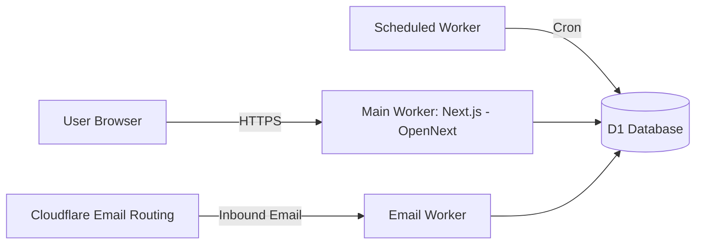

# FlashInbox / 闪收箱


基于 Cloudflare Workers + D1 的临时邮箱服务（不含附件），支持匿名创建邮箱、接收邮件、认领获取 Key、通过 `username + key` 恢复访问（默认 15 天有效期，可续期），并提供管理后台用于域名/规则/隔离/审计与数据看板。

**快速入口**
- 文档：`spec/01spec.md`（需求） / `spec/02design.md`（设计） / `spec/03task.md`（任务）
- 本地开发：见「本地开发」
- 部署上线：见「从零开始部署（生产）」
- API：见「API 概览」

## 目录

- 一键部署（主应用）
- 功能
- 架构概览
- 技术栈
- 本地开发
- 从零开始部署（生产）
- API 概览
- 安全与注意事项
- 常用命令
- 目录结构（简化）
- License

## 一键部署（主应用）

[](https://deploy.workers.cloudflare.com/?url=https://github.com/<OWNER>/<REPO>)

说明：
- 将链接中的 `https://github.com/<OWNER>/<REPO>` 替换为你 fork 后的仓库地址
- 一键部署通常只会部署 `wrangler.toml` 对应的主应用；Email Worker 与 Scheduled Worker 仍需按下方流程手动部署与配置

## 功能

- 邮箱创建：随机生成或手动指定用户名（`random` / `manual`）
- 入站收信：Email Worker 解析并存储邮件（正文可截断，HTML 会净化；附件不存储）
- 认领系统：未认领邮箱可通过 Turnstile 验证后认领，返回一次性明文 Key
- 恢复访问：`username + domain + key` 恢复并创建会话（错误信息不区分邮箱不存在与 key 错误）
- 管理后台：域名管理、规则（drop/quarantine/allow）、隔离队列、审计与仪表盘

## 架构概览



## 技术栈

- Next.js App Router（OpenNext 适配 Cloudflare Workers）
- Cloudflare Workers / Email Workers / Scheduled Workers
- Cloudflare D1（SQLite）
- 用户端：MDUI 2（MD3 风格）+ Iconify（mdi）
- 管理端：TailAdmin + shadcn/ui（Tailwind 体系）+ Iconify（lucide）
- 包管理器：bun（禁止使用 npm / yarn / pnpm）

## 本地开发

### 前置条件

- `bun`（包管理与脚本执行）
- `wrangler`（本项目已在 `devDependencies` 中提供，可用 `bunx wrangler`）

### 1) 安装依赖

```bash
bun install
```

### 2) 本地测试

```bash
# 全部测试
bun test

# 单元测试 / 集成测试
bun run test:unit
bun run test:integration
```

### 3) 准备配置

本项目本地开发使用 SQLite，生产部署使用 Cloudflare D1。配置分成两条链路：
- 本地：`.env` + `.tmp/flashinbox-local.sqlite`
- 部署：`wrangler.toml` / `wrangler.email.toml` / `wrangler.scheduled.toml`

#### Wrangler 配置文件说明

本仓库包含 3 份 Wrangler 配置文件，分别对应 3 个独立 Worker（主应用、入站邮件、定时任务）：

| 文件 | Worker 名称（`name`） | 入口（`main`） | 触发方式 | 用途 |
| --- | --- | --- | --- | --- |
| `wrangler.toml` | `flashinbox` | `.open-next/worker.js` | HTTP 路由（`routes`） | 主应用（Next.js App Router + API） |
| `wrangler.email.toml` | `flashinbox-email` | `src/workers/email/index.ts` | Email Routing（Dashboard 配置） | 入站邮件解析与入库 |
| `wrangler.scheduled.toml` | `flashinbox-scheduled` | `src/workers/scheduled/cleanup.ts` | Cron（`[triggers].crons`） | 清理/统计等定时任务 |

常用部署命令：
- 主应用：`wrangler deploy --config .tmp/wrangler.main.toml --env production`
- Email Worker：`wrangler deploy --config .tmp/wrangler.email.toml`
- Scheduled Worker：`wrangler deploy --config .tmp/wrangler.scheduled.toml`

关键字段含义（同名字段在 3 个文件中含义一致）：
- `compatibility_date`：Workers 兼容性日期，固定运行时行为，避免平台升级导致差异
- `compatibility_flags = ["nodejs_compat"]`：开启 Node.js 兼容层（用于依赖/部分 Node API 适配）
- `main`：Worker 入口文件路径
- `assets = { directory, binding }`：仅主应用使用的静态资源发布与绑定（OpenNext 产物）
- `routes`：仅主应用使用的 HTTP 路由规则（生产环境通常配置自定义域名）
- `[env.production]`：主应用生产环境配置（用 `wrangler deploy --env production` 选择）
- `[[d1_databases]]`：D1 绑定（代码中通过 `env.DB` 访问）
  - `database_name`：D1 实例名称
  - `database_id`：D1 实例 ID（远程部署时必填；本地可为空或占位）
- `[vars]`：非敏感环境变量（可在面板查看），用于业务参数（域名、过期时间、正文上限等）
- Secrets：敏感变量（通过 `wrangler secret put` 写入，不应出现在配置文件中）
- `[triggers].crons`：仅 Scheduled Worker 使用的 Cron 触发器列表（每个表达式都会触发一次执行）

**主应用 Secrets（必需）**

| Key | 用途 |
| --- | --- |
| `ADMIN_TOKEN` | 管理后台登录令牌 |
| `KEY_PEPPER` | Key 哈希 pepper（`SHA-256(key + pepper)`） |
| `SESSION_SECRET` | 会话签名密钥 |
| `TURNSTILE_SECRET_KEY` | Turnstile 服务端密钥 |
| `TURNSTILE_SITE_KEY` | Turnstile 前端 site key |

**常用 Vars（见 `wrangler.toml`）**

| Key | 说明 |
| --- | --- |
| `DEFAULT_DOMAIN` | 默认邮箱域名 |
| `KEY_EXPIRE_DAYS` | Key 有效期（天） |
| `UNCLAIMED_EXPIRE_DAYS` | 未认领邮箱过期（天） |
| `SESSION_EXPIRE_HOURS` | 用户会话有效期（小时） |
| `ADMIN_SESSION_EXPIRE_HOURS` | 管理会话有效期（小时） |
| `MAX_BODY_TEXT` / `MAX_BODY_HTML` | 正文截断上限 |
| `RATE_LIMIT_*` | 限流规则（如 `10/10m`） |

说明：配置解析与校验逻辑在 `src/lib/types/env.ts`。

#### Umami（可选）

Umami 统计使用 **环境变量（Vars）** 配置，不使用数据库配置。

仅主应用（`wrangler.toml` 对应 Worker）需要配置 Umami；Email / Scheduled Worker 无需配置。

##### 1) 配置 Umami 连接信息

需要设置以下变量（Vars）：

| Key | 说明 |
| --- | --- |
| `UMAMI_SCRIPT_URL` | Umami 脚本地址，例如 `https://analytics.example.com/script.js` |
| `UMAMI_WEBSITE_ID` | 用户端网站 ID（UUID） |
| `UMAMI_ADMIN_WEBSITE_ID` | 管理端网站 ID（UUID，可选） |

设置方式（二选一）：

1) 写入 `wrangler.toml` 的 `[vars]` 或 `[env.production.vars]`

2) Cloudflare Dashboard → Workers → Settings → Variables（为对应 Worker 配置 Vars）

示例（`wrangler.toml` / `env.production.vars`）：

```toml
[env.production.vars]
UMAMI_SCRIPT_URL = "https://analytics.example.com/script.js"
UMAMI_WEBSITE_ID = "00000000-0000-0000-0000-000000000000"
UMAMI_ADMIN_WEBSITE_ID = "00000000-0000-0000-0000-000000000000" # optional
```

或通过 `wrangler secret put` 设置：
```bash
wrangler secret put UMAMI_SCRIPT_URL --env production
# 输入: "https://analytics.example.com/script.js"
wrangler secret put UMAMI_WEBSITE_ID --env production
# 输入: "00000000-0000-0000-0000-000000000000"
wrangler secret put UMAMI_ADMIN_WEBSITE_ID --env production
# 输入: "00000000-0000-0000-0000-000000000000"， 
```

##### 2) 配置 CSP 白名单（必需时）

本项目 CSP 由 `src/middleware.ts` 动态生成：
- 会自动从 `UMAMI_SCRIPT_URL` 提取 origin，并加入 `script-src` / `connect-src`
- 若需要额外放行多个 Umami 源（例如多域名、代理层、或脚本/上报不在同一 origin），用环境变量追加 allowlist

| Key | 说明 |
| --- | --- |
| `UMAMI_ALLOWED_ORIGINS` | 额外允许的 Umami 源（origin 列表，逗号或空格分隔），例如 `https://analytics.example.com https://analytics2.example.com` |
| `NEXT_PUBLIC_UMAMI_ALLOWED_ORIGINS` | 同上（兼容本地 Next.js 环境变量命名） |

示例：

```toml
[env.production.vars]
UMAMI_ALLOWED_ORIGINS = "https://analytics.example.com https://analytics2.example.com"
```

##### 3) 验证与排错

- 用户端通过 `/api/user/config` 下发 Umami 配置，存在时自动注入脚本并在路由切换时调用 `umami.track()`（见 `src/components/ui/UmamiLoader.tsx`）
- 管理端通过 `/api/admin/config` 下发 Umami 配置（无需登录），同样自动注入脚本并跟踪路由切换
- 若浏览器控制台出现 CSP 报错，请确认 `UMAMI_SCRIPT_URL` 与 `UMAMI_ALLOWED_ORIGINS` 覆盖了 Umami 脚本与上报请求的 origin，然后重新部署/刷新生效
- 管理端可在 `/admin/settings` 查看当前 Umami 配置（页面为只读；修改环境变量后需重新部署/刷新生效）

### 4) 本地开发

```bash
# 启动 Next.js 开发服务器
bun run dev

# 如需同时看 wrangler 绑定行为
bun run dev:wrangler

# 两者同时启动
bun run dev:all
```

本地 SQLite 数据库默认路径为 `.tmp/flashinbox-local.sqlite`，第一次启动会由测试/开发代码自动按迁移初始化。
`bun run dev` 还会把它复制到 OpenNext/Wrangler 的本地 D1 状态目录 `.wrangler/state/v3/d1/miniflare-D1DatabaseObject/*.sqlite`，Next.js API 实际通过这个 D1 binding 读写数据。
如果上一次 `next dev` 异常退出留下 `.next/dev/lock`，启动前会在确认 `PORT`（默认 `3000`）不可达时自动移除残留锁。
如果当前环境禁止 Wrangler 启动本地运行时，可用 `PREPARE_WRANGLER_D1=0 bun run prepare:local-db` 只初始化导出的 SQLite 文件。
`.env` 里还要保留 `CLOUDFLARE_ACCOUNT_ID`、`CLOUDFLARE_API_TOKEN`、`D1_DATABASE_ID`，用于远程 D1 同步和生成部署配置。

### 5) 从远程 D1 同步到本地 SQLite

```bash
bun run d1:sync-local
```

说明：
- 需要先 `wrangler login`
- 需要在 `.env` 中设置 `D1_DATABASE_NAME`
- 同步结果写入 `.tmp/flashinbox-local.sqlite`，并复制到 `.wrangler/state/v3/d1/miniflare-D1DatabaseObject/*.sqlite`
- 该命令会先从远程 D1 导出数据，再按迁移重建本地 SQLite

### 6) 本地联调（可选）

```bash
curl -s http://127.0.0.1:3000/api/user/config
```

## 从零开始部署（生产）

目标：一次性部署 3 个 Worker（主应用 / Email / Scheduled），绑定同一个 D1，并在 Cloudflare Email Routing 中将入站邮件转发到 Email Worker。

### 0) 前置条件

- Cloudflare 账号（开通 Workers、D1、Email Routing、Turnstile）
- 一个用于收信的域名（例如 `flashinbox.de`），已接入 Cloudflare DNS，Email Routing 显示 Domain 为 Enabled
- 本地已安装 `bun` 与 `wrangler`（本项目可用 `bunx wrangler`）
- 已 fork 本仓库并克隆到本地

### 1) 安装依赖

```bash
bun install
```

### 2) 登录 Cloudflare

```bash
wrangler login
```

### 3) 创建 D1（远程）

```bash
wrangler d1 create flashinbox-db
```

将创建结果里的 `database_id` 填入 `.env` 的 `D1_DATABASE_ID`，再执行生成脚本输出临时部署配置。

生成配置：
```bash
bun run prepare:wrangler:main
bun run prepare:wrangler:email
bun run prepare:wrangler:scheduled
```

### 4) 执行迁移（远程）

```bash
wrangler d1 execute flashinbox-db --remote --file=migrations/0001_init.sql
wrangler d1 execute flashinbox-db --remote --file=migrations/0002_mailboxes_banned.sql
```

说明：
- 若你看到类似 “please use ... instead of the SQL BEGIN TRANSACTION or SAVEPOINT” 的报错，请确保迁移文件中没有 `BEGIN TRANSACTION` / `COMMIT` / `SAVEPOINT`（本仓库的 `migrations/0002_mailboxes_banned.sql` 已按该要求编写）

说明：
- `0002` 仅用于启用邮箱禁用（`banned`）状态；如果不执行该迁移，后台“禁用邮箱”会因 `CHECK` 约束失败而报错

### 5) 配置主应用路由与默认域名

修改 `.env` 和 `wrangler.toml` 的生产环境模板：
- `env.production.routes[0].pattern` 例如 `mail.flashinbox.de`
- `DEFAULT_DOMAIN` 设置为你的收信域名（例如 `flashinbox.de`）

说明：
- Web 访问域名（例如 `mail.flashinbox.de`）与收信域名（例如 `flashinbox.de`）可以不同；Email Routing 的 Catch-all 只对主域生效，不适用于 `mail.<domain>` 这种子域

### 6) 创建 Turnstile

Cloudflare Dashboard → Turnstile：
- 绑定主应用域名（例如 `mail.flashinbox.de`）
- 获取 `TURNSTILE_SITE_KEY` 与 `TURNSTILE_SECRET_KEY`

### 7) 设置主应用 Secrets（生产环境）

```bash
wrangler secret put ADMIN_TOKEN --env production
wrangler secret put KEY_PEPPER --env production
wrangler secret put SESSION_SECRET --env production
wrangler secret put TURNSTILE_SECRET_KEY --env production
wrangler secret put TURNSTILE_SITE_KEY --env production
```

说明：
- `KEY_PEPPER` 为关键安全配置，主应用用于 claim/recover 等需要写入 `mailboxes.key_hash` 的流程
- Email Worker 与 Scheduled Worker 当前不需要 Secrets（仅需 D1 绑定与必要 Vars）

### 8) 部署主应用（Next.js -> Workers）

```bash
bun run build:worker
wrangler deploy --config .tmp/wrangler.main.toml --env production
```

### 9) 部署 Email Worker（入站收信）

```bash
wrangler deploy --config .tmp/wrangler.email.toml
```

### 10) 部署 Scheduled Worker（清理与统计）

```bash
wrangler deploy --config .tmp/wrangler.scheduled.toml
```

### 11) 初始化域名数据（收信必需）

Email Worker 会查询 D1 的 `domains` 表决定是否接收邮件；如果 `domains` 中没有你的域名，或状态为 `disabled/readonly`，入站邮件会被拒绝/丢弃（Cloudflare Email Routing 的 Activity log 通常显示 Result 为 Dropped）。

两种方式二选一：

1) 使用管理后台添加域名：
- 访问 `https://<your-app-domain>/admin`
- 输入 `ADMIN_TOKEN` 登录
- 在 Domains 页面添加 `flashinbox.de`，状态选择 `enabled`

2) 直接写入 D1（远程）：

```bash
wrangler d1 execute flashinbox-db --remote --command "INSERT INTO domains (name, status, note, created_at, updated_at) VALUES ('flashinbox.de', 'enabled', 'prod', strftime('%s','now')*1000, strftime('%s','now')*1000);"
```

说明：
- 如果你有多个收信域名（例如 `flashinbox.de` + `514819.xyz`），每个域名都需要写入 `domains` 表并设置为 `enabled`

### 12) 配置 Email Routing（收信必需）

在 Cloudflare Dashboard 中对你的域名开启 Email Routing，并创建路由规则：
- 推荐：启用 **Catch-all address**，Action 选择 `Send to a Worker`，Worker 选择 `flashinbox-email`
- 若 Catch-all 为 `Drop` 或未配置为 Worker，发送到未匹配 Custom address 的邮件会被直接丢弃，通常不会产生退信
- Catch-all 规则只对主域生效，不能对每个子域单独创建（例如 `mail.flashinbox.de` 这种子域不适用）

### 13) 验证与排错

- 访问主应用域名（例如 `https://mail.yourdomain.com`）
- 创建邮箱后，从外部邮箱向 `username@yourdomain.com` 发送邮件，确认收件箱可见
  - 若 Email Routing 的 Activity log 显示 Result 为 Dropped：
    - 确认 `domains` 表中存在收信域名且为 `enabled`
    - `wrangler tail flashinbox-email` 查看 Email Worker 日志，检查是否出现 `Domain not found` / `Domain is disabled` / 解析异常
    - 检查是否配置了规则将邮件 `drop`（Rules 页面）

## API 概览

用户侧：
- `POST /api/user/create`：创建邮箱（`mode=random|manual`，可传 `username` / `domainId`）
- `POST /api/user/claim`：认领邮箱（`mailboxId` 或 `email` + `turnstileToken`，返回一次性 `key`）
- `POST /api/user/recover`：恢复访问（`username` + `domain` + `key`）
- `POST /api/user/renew`：续期（需用户会话）
- `GET /api/user/domains`：可用域名列表
- `GET /api/user/config`：前端配置（默认域名、Turnstile site key）

邮箱侧（需用户会话）：
- `GET /api/mailbox/info`：邮箱信息与未读数
- `GET /api/mailbox/inbox`：收件箱列表（分页、未读过滤、搜索）

管理侧（需管理员会话）：
- `POST /api/admin/login`：管理员登录（`token` + `fingerprint`）
- `POST /api/admin/logout`：退出
- `GET/POST /api/admin/domains`：域名管理
- `GET/POST /api/admin/rules`：规则管理
- `GET /api/admin/mailboxes`：邮箱列表（支持过滤）
- `GET /api/admin/mailboxes/:mailboxId`：邮箱详情
- `PATCH /api/admin/mailboxes/:mailboxId`：禁用邮箱（`{ "status": "banned" }`）
- `DELETE /api/admin/mailboxes/:mailboxId`：删除邮箱（destroy，删除关联消息/隔离/会话并标记销毁）
- `GET /api/admin/quarantine`：隔离队列
- `GET /api/admin/dashboard`：仪表盘数据（`range=24h|7d|30d`）

## 安全与注意事项

- Key 不以明文存储：使用 `SHA-256(key + pepper)`，比较使用恒定时间比较
- 恢复接口错误不区分“邮箱不存在”和“Key 错误”，降低信息泄露风险
- HTML 邮件会净化后再渲染（避免 XSS）
- 中间件统一设置安全响应头与 CSP：用户站点允许 Turnstile，管理后台更严格（见 `src/middleware.ts`）

## 常用命令

| 目的 | 命令 |
| --- | --- |
| 本地开发 | `bun run dev` |
| 本地 Workers | `bun run dev:wrangler` |
| 同时启动 | `bun run dev:all` |
| 从远程 D1 同步到本地 SQLite | `bun run d1:sync-local` |
| 构建 Worker | `bun run build:worker` |
| 生成主应用部署配置 | `bun run prepare:wrangler:main` |
| 部署全部 Worker | `bun run deploy` |
| 格式化 | `bun run format` |
| Lint | `bun run lint` |
| 类型检查 | `bun run typecheck` |
| 测试 | `bun test` |

## 目录结构（简化）

```
src/app/           Next.js App Router（页面与 API）
src/lib/           核心库（db/services/utils/middleware/types）
src/workers/       Email Worker 与 Scheduled Worker
migrations/        D1 迁移
spec/              需求与设计文档
```

## License

MIT（见 `LICENSE`）
