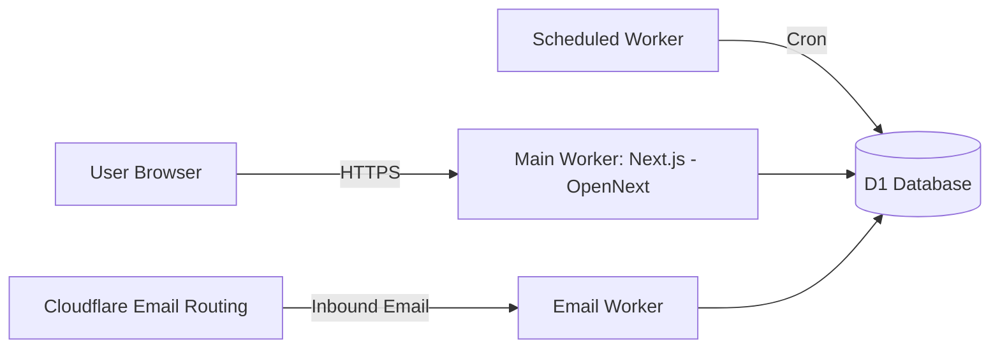

# FlashInbox / 闪收箱


基于 Cloudflare Workers + D1 的临时邮箱服务（不含附件），支持匿名创建邮箱、接收邮件、认领获取 Key、通过 `username + key` 恢复访问（默认 15 天有效期，可续期），并提供管理后台用于域名/规则/隔离/审计与数据看板。

**快速入口**
- 文档：`spec/01spec.md`（需求） / `spec/02design.md`（设计） / `spec/03task.md`（任务）
- 本地开发：见「本地开发」
- 部署上线：见「部署」
- API：见「API 概览」

## 一键部署（主应用）

[](https://deploy.workers.cloudflare.com/?url=https://github.com/<OWNER>/<REPO>)

说明：
- 将链接中的 `https://github.com/<OWNER>/<REPO>` 替换为你 fork 后的仓库地址
- 一键部署通常只会部署 `wrangler.toml` 对应的主应用；Email Worker 与 Scheduled Worker 仍需按下方流程手动部署与配置

## 功能

- 邮箱创建：随机生成或手动指定用户名（`random` / `manual`）
- 入站收信：Email Worker 解析并存储邮件（正文可截断，HTML 会净化；附件不存储）
- 认领系统：未认领邮箱可通过 Turnstile 验证后认领，返回一次性明文 Key
- 恢复访问：`username + domain + key` 恢复并创建会话（错误信息不区分邮箱不存在与 key 错误）
- 管理后台：域名管理、规则（drop/quarantine/allow）、隔离队列、审计与仪表盘

## 架构概览



## 技术栈

- Next.js App Router（OpenNext 适配 Cloudflare Workers）
- Cloudflare Workers / Email Workers / Scheduled Workers
- Cloudflare D1（SQLite）
- 用户端：MDUI 2（MD3 风格）+ Iconify（mdi）
- 管理端：TailAdmin + shadcn/ui（Tailwind 体系）+ Iconify（lucide）
- 包管理器：bun（禁止使用 npm / yarn / pnpm）

## 本地开发

### 前置条件

- `bun`（包管理与脚本执行）
- `wrangler`（本项目已在 `devDependencies` 中提供，可用 `bunx wrangler`）

### 1) 安装依赖

```bash
bun install
```

### 2) 本地测试

```bash
# 全部测试
bun test

# 单元测试 / 集成测试
bun run test:unit
bun run test:integration
```

### 3) 准备配置

本项目运行在 Cloudflare Workers 环境中，通过 `wrangler.toml` / `wrangler.email.toml` / `wrangler.scheduled.toml` 配置 D1 绑定与环境变量。

**主应用 Secrets（必需）**

| Key | 用途 |
| --- | --- |
| `ADMIN_TOKEN` | 管理后台登录令牌 |
| `KEY_PEPPER` | Key 哈希 pepper（`SHA-256(key + pepper)`） |
| `SESSION_SECRET` | 会话签名密钥 |
| `TURNSTILE_SECRET_KEY` | Turnstile 服务端密钥 |
| `TURNSTILE_SITE_KEY` | Turnstile 前端 site key |

**常用 Vars（见 `wrangler.toml`）**

| Key | 说明 |
| --- | --- |
| `DEFAULT_DOMAIN` | 默认邮箱域名 |
| `KEY_EXPIRE_DAYS` | Key 有效期（天） |
| `UNCLAIMED_EXPIRE_DAYS` | 未认领邮箱过期（天） |
| `SESSION_EXPIRE_HOURS` | 用户会话有效期（小时） |
| `ADMIN_SESSION_EXPIRE_HOURS` | 管理会话有效期（小时） |
| `MAX_BODY_TEXT` / `MAX_BODY_HTML` | 正文截断上限 |
| `RATE_LIMIT_*` | 限流规则（如 `10/10m`） |

说明：配置解析与校验逻辑在 `src/lib/types/env.ts`。

### 4) 初始化 D1（本地）

```bash
# 创建本地 D1（名称可自行调整）
wrangler d1 create flashinbox-db-dev

# 执行迁移（本地）
wrangler d1 execute flashinbox-db-dev --local --file=migrations/0001_init.sql
```

### 5) 启动开发

```bash
# Next.js 开发服务器（页面与 API）
bun run dev

# 构建 OpenNext Worker 并用 wrangler 启动（更接近生产）
bun run dev:wrangler

# 两者同时启动
bun run dev:all
```

### 6) 本地联调（可选）

```bash
curl -s http://127.0.0.1:8787/api/user/config
```

## 部署

### 0) 前置条件

- Cloudflare 账号（已开通 Workers、D1、Email Routing）
- 已准备一个可托管的邮箱域名（用于收信），并在 Cloudflare 托管 DNS
- 已创建 Turnstile 小组件，拿到 `TURNSTILE_SITE_KEY` 与 `TURNSTILE_SECRET_KEY`

### 1) 登录 Cloudflare

```bash
wrangler login
```

### 2) 创建 D1（远程）

```bash
wrangler d1 create flashinbox-db
wrangler d1 create flashinbox-db-dev
```

将创建结果里的 `database_id` 填入以下配置：
- `wrangler.toml`：`env.production.d1_databases[0].database_id` 与 `env.dev.d1_databases[0].database_id`
- `wrangler.email.toml`：`d1_databases[0].database_id`
- `wrangler.scheduled.toml`：`d1_databases[0].database_id`

### 3) 执行迁移（远程）

```bash
wrangler d1 execute flashinbox-db --remote --file=migrations/0001_init.sql
wrangler d1 execute flashinbox-db-dev --remote --file=migrations/0001_init.sql
```

### 4) 配置主应用域名路由与默认域名

修改 `wrangler.toml` 的生产环境配置：
- `env.production.routes[0].pattern` 例如 `mail.yourdomain.com`
- `DEFAULT_DOMAIN` 设置为你的收信域名（例如 `yourdomain.com`）

### 5) 设置主应用 Secrets（生产环境）

```bash
wrangler secret put ADMIN_TOKEN --env production
wrangler secret put KEY_PEPPER --env production
wrangler secret put SESSION_SECRET --env production
wrangler secret put TURNSTILE_SECRET_KEY --env production
wrangler secret put TURNSTILE_SITE_KEY --env production
```

说明：
- `KEY_PEPPER` 为关键安全配置，主应用用于 claim/recover 等需要写入 `mailboxes.key_hash` 的流程
- Email Worker 与 Scheduled Worker 当前不需要 Secrets（仅需 D1 绑定与必要 Vars）

### 6) 部署主应用（Next.js -> Workers）

```bash
bun run build:worker
wrangler deploy --env production
```

### 7) 部署 Email Worker（入站收信）

```bash
wrangler deploy --config wrangler.email.toml
```

### 8) 部署 Scheduled Worker（清理与统计）

```bash
wrangler deploy --config wrangler.scheduled.toml
```

### 9) 配置 Email Routing（收信必需）

在 Cloudflare Dashboard 中对你的域名开启 Email Routing，并创建路由规则：
- Catch-all 或按需匹配（例如 `*@yourdomain.com`）
- Action 选择 `Send to a Worker`
- Worker 选择 `flashinbox-email`

### 10) 验证

- 访问主应用域名（例如 `https://mail.yourdomain.com`）
- 创建邮箱后，从外部邮箱向 `username@yourdomain.com` 发送邮件，确认收件箱可见
  - 若收信正常但列表为空，优先检查 Email Routing 规则是否命中，以及 Email Worker 是否绑定到了同一个 D1

## API 概览

用户侧：
- `POST /api/user/create`：创建邮箱（`mode=random|manual`，可传 `username` / `domainId`）
- `POST /api/user/claim`：认领邮箱（`mailboxId` 或 `email` + `turnstileToken`，返回一次性 `key`）
- `POST /api/user/recover`：恢复访问（`username` + `domain` + `key`）
- `POST /api/user/renew`：续期（需用户会话）
- `GET /api/user/domains`：可用域名列表
- `GET /api/user/config`：前端配置（默认域名、Turnstile site key）

邮箱侧（需用户会话）：
- `GET /api/mailbox/info`：邮箱信息与未读数
- `GET /api/mailbox/inbox`：收件箱列表（分页、未读过滤、搜索）

管理侧（需管理员会话）：
- `POST /api/admin/login`：管理员登录（`token` + `fingerprint`）
- `POST /api/admin/logout`：退出
- `GET/POST /api/admin/domains`：域名管理
- `GET/POST /api/admin/rules`：规则管理
- `GET /api/admin/quarantine`：隔离队列
- `GET /api/admin/dashboard`：仪表盘数据（`range=24h|7d|30d`）

## 安全与注意事项

- Key 不以明文存储：使用 `SHA-256(key + pepper)`，比较使用恒定时间比较
- 恢复接口错误不区分“邮箱不存在”和“Key 错误”，降低信息泄露风险
- HTML 邮件会净化后再渲染（避免 XSS）
- 中间件统一设置安全响应头与 CSP：用户站点允许 Turnstile，管理后台更严格（见 `src/middleware.ts`）

## 常用命令

| 目的 | 命令 |
| --- | --- |
| 本地开发 | `bun run dev` |
| 本地 Workers | `bun run dev:wrangler` |
| 同时启动 | `bun run dev:all` |
| 构建 Worker | `bun run build:worker` |
| 部署主应用 | `wrangler deploy --env production` |
| 格式化 | `bun run format` |
| Lint | `bun run lint` |
| 类型检查 | `bun run typecheck` |
| 测试 | `bun test` |

## 目录结构（简化）

```
src/app/           Next.js App Router（页面与 API）
src/lib/           核心库（db/services/utils/middleware/types）
src/workers/       Email Worker 与 Scheduled Worker
migrations/        D1 迁移
spec/              需求与设计文档
```

## License

TBD
