# FlashInbox / 闪收箱 设计文档

> 基于 01spec.md 需求规格，本文档定义系统架构、数据模型、接口规范与流程设计。

---

## 1. 系统架构

### 1.1 架构概览

```mermaid
graph TB
    subgraph UserLayer["用户层"]
        U1[首页/创建]
        U2[收件箱]
        U3[恢复/续期]
        U4[管理后台]
    end

    subgraph Frontend["前端层 - Next.js"]
        FE1[用户端: MDUI 2]
        FE2[管理端: TailAdmin + shadcn/ui]
    end

    subgraph API["API 层 - Cloudflare Workers"]
        API1[/api/user/*]
        API2[/api/mailbox/*]
        API3[/api/admin/*]
        MW[中间件: 限流/认证/审计]
    end

    subgraph Service["服务层"]
        S1[MailboxService]
        S2[MessageService]
        S3[KeyService]
        S4[RuleService]
    end

    subgraph Data["数据层 - Cloudflare D1"]
        DB[(mailboxes/messages/domains/rules/sessions)]
    end

    subgraph Email["邮件入站"]
        MTA[外部MTA] --> CFR[CF Email Routing]
        CFR --> EW[Email Worker]
    end

    UserLayer --> Frontend
    Frontend -->|HTTPS| API
    API1 & API2 & API3 --> MW
    MW --> Service
    Service --> Data
    EW --> Data
```

### 1.2 部署架构

采用 **形态 B**：Next.js 全栈通过 OpenNext 部署到 Cloudflare Workers。

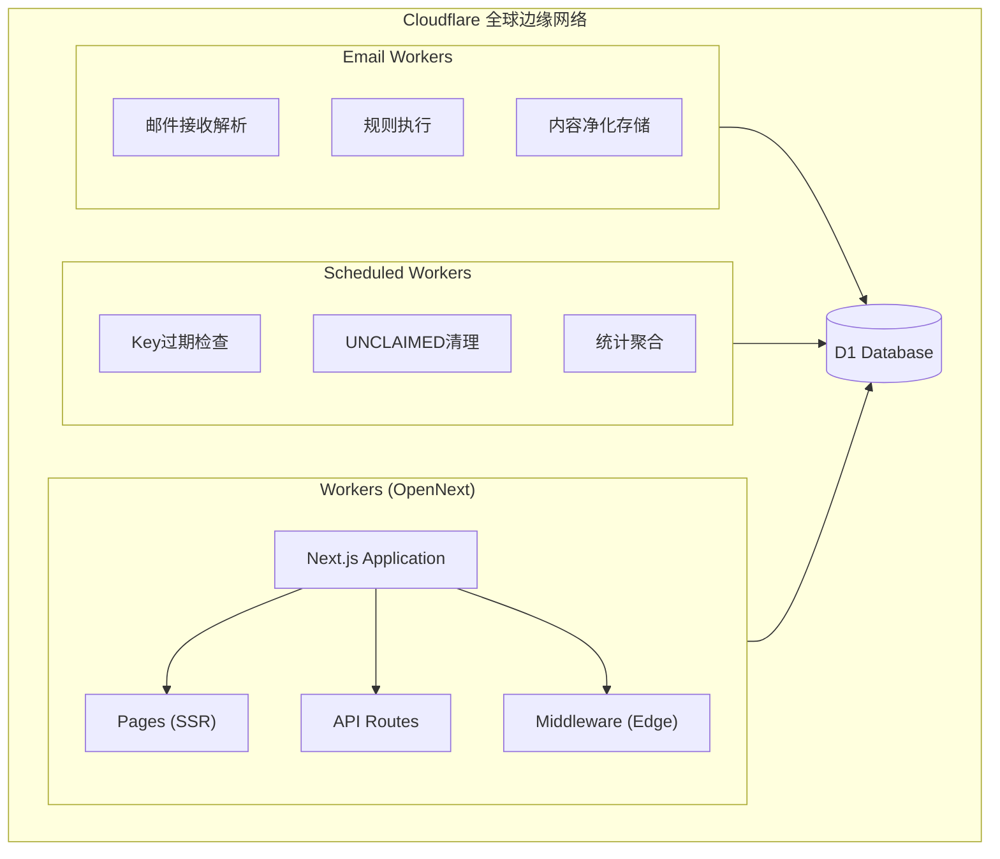

### 1.3 技术栈确认

| 层级 | 技术选型 | 说明 |
|------|----------|------|
| 前端框架 | Next.js 14+ (App Router) | SSR/CSR 混合，Edge Runtime |
| 用户端 UI | MDUI 2 | Material Design 3（严格遵循） |
| 管理端 UI | TailAdmin + shadcn/ui | Tailwind 体系，现代仪表盘 |
| 样式方案 | Tailwind CSS | 原子化 CSS |
| 图标 | Iconify | mdi（用户端）/ lucide（管理端） |
| 运行时 | Cloudflare Workers | Edge Runtime，全球分布 |
| 数据库 | Cloudflare D1 | SQLite 兼容，Serverless |
| 邮件接收 | CF Email Routing + Workers | 最大 25MiB |
| 人机验证 | Cloudflare Turnstile | 隐私友好的验证码 |
| 分析追踪 | Umami (自托管) | 隐私优先的分析工具 |
| 部署适配 | OpenNext | Next.js → CF Workers 适配器 |

### 1.4 环境变量设计

```typescript
// 环境变量类型定义
interface Env {
  // === 必需配置 (Secrets) ===
  ADMIN_TOKEN: string;          // 管理员登录令牌
  KEY_PEPPER: string;           // Key 哈希加盐（不可更改）
  SESSION_SECRET: string;       // 会话签名密钥
  
  // === 必需配置 (Vars) ===
  DEFAULT_DOMAIN: string;       // 默认邮箱域名
  
  // === 可选配置 (Vars with defaults) ===
  KEY_EXPIRE_DAYS?: string;           // Key 有效期，默认 "15"
  UNCLAIMED_EXPIRE_DAYS?: string;     // 未认领邮箱保留期，默认 "7"
  SESSION_EXPIRE_HOURS?: string;      // 会话有效期，默认 "24"
  
  // === 限流配置 ===
  RATE_LIMIT_CREATE?: string;         // 创建限流，默认 "10/10m"
  RATE_LIMIT_CLAIM?: string;          // 认领限流，默认 "3/30m"
  RATE_LIMIT_RECOVER?: string;        // 恢复限流，默认 "5/60m"
  RATE_LIMIT_RENEW?: string;          // 续期限流，默认 "10/60m"
  
  // === Umami 配置 ===
  UMAMI_SCRIPT_URL?: string;          // Umami 脚本地址
  UMAMI_WEBSITE_ID?: string;          // 用户站点 ID
  UMAMI_ADMIN_WEBSITE_ID?: string;    // 管理后台站点 ID
  
  // === Turnstile 配置 ===
  TURNSTILE_SITE_KEY: string;         // 前端站点密钥
  TURNSTILE_SECRET_KEY: string;       // 后端验证密钥
  
  // === Bindings ===
  DB: D1Database;                     // D1 数据库绑定
}
```

### 1.5 安全架构

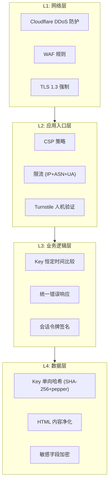

---

## 2. 数据模型

### 2.1 ER 图

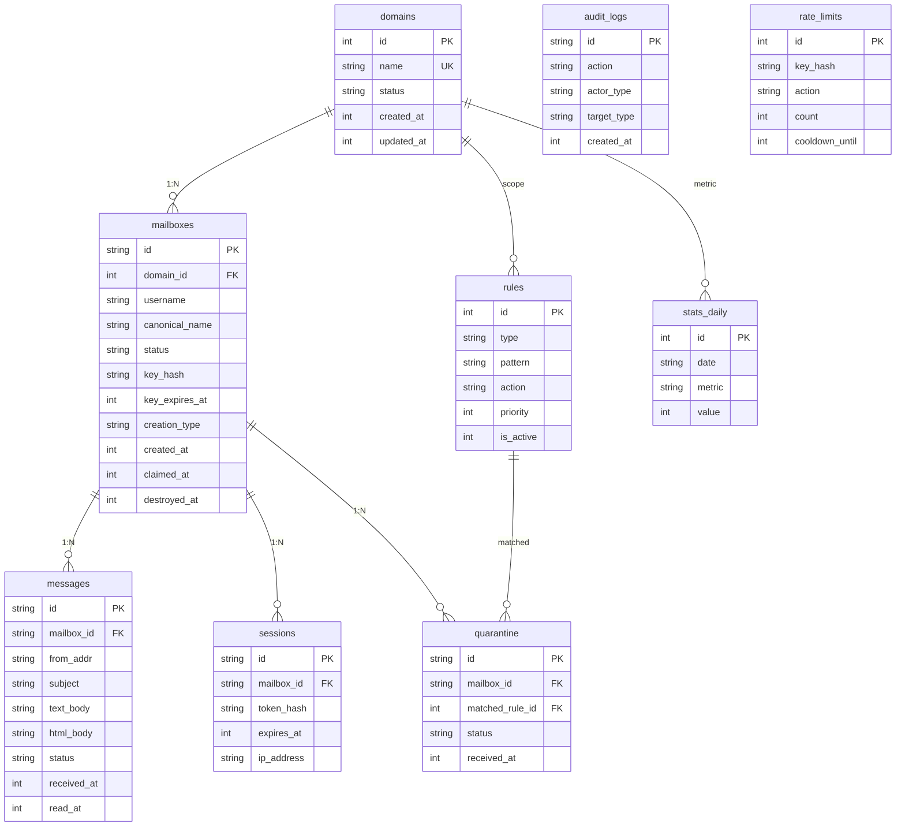

### 2.2 表结构定义 (D1 SQLite)

#### 2.2.1 domains - 域名表

```sql
CREATE TABLE domains (
    id              INTEGER PRIMARY KEY AUTOINCREMENT,
    name            TEXT NOT NULL UNIQUE,           -- 域名，如 'mail.example.com'
    status          TEXT NOT NULL DEFAULT 'enabled', -- enabled/disabled/readonly
    note            TEXT,                           -- 管理员备注
    created_at      INTEGER NOT NULL,               -- Unix timestamp (ms)
    updated_at      INTEGER NOT NULL,               -- Unix timestamp (ms)
    
    CHECK (status IN ('enabled', 'disabled', 'readonly'))
);

CREATE INDEX idx_domains_status ON domains(status);
```

#### 2.2.2 mailboxes - 邮箱表

```sql
CREATE TABLE mailboxes (
    id              TEXT PRIMARY KEY,               -- UUID v4
    domain_id       INTEGER NOT NULL,               -- 关联域名
    username        TEXT NOT NULL,                  -- 原始用户名，如 'BluePanda23'
    canonical_name  TEXT NOT NULL,                  -- 规范化名称，如 'bluepanda23'
    status          TEXT NOT NULL DEFAULT 'unclaimed', -- unclaimed/claimed/destroyed
    
    -- Key 相关（仅 claimed 状态有值）
    key_hash        TEXT,                           -- SHA-256(key + pepper) 哈希
    key_created_at  INTEGER,                        -- Key 创建时间
    key_expires_at  INTEGER,                        -- Key 过期时间
    
    -- 创建方式
    creation_type   TEXT NOT NULL,                  -- random/manual/inbound
    
    -- 时间戳
    created_at      INTEGER NOT NULL,               -- 创建时间
    claimed_at      INTEGER,                        -- 认领时间
    destroyed_at    INTEGER,                        -- 销毁时间
    last_mail_at    INTEGER,                        -- 最后收信时间
    
    FOREIGN KEY (domain_id) REFERENCES domains(id),
    UNIQUE (domain_id, canonical_name),
    CHECK (status IN ('unclaimed', 'claimed', 'destroyed'))
);

CREATE INDEX idx_mailboxes_domain_canonical ON mailboxes(domain_id, canonical_name);
CREATE INDEX idx_mailboxes_status ON mailboxes(status);
CREATE INDEX idx_mailboxes_key_expires ON mailboxes(key_expires_at) WHERE key_expires_at IS NOT NULL;
```

#### 2.2.3 messages - 邮件表

```sql
CREATE TABLE messages (
    id              TEXT PRIMARY KEY,               -- UUID v4
    mailbox_id      TEXT NOT NULL,                  -- 关联邮箱
    
    -- 邮件头信息
    message_id      TEXT,                           -- 原始 Message-ID
    from_addr       TEXT NOT NULL,                  -- 发件人地址
    from_name       TEXT,                           -- 发件人显示名
    to_addr         TEXT NOT NULL,                  -- 收件人地址
    subject         TEXT,                           -- 主题
    mail_date       INTEGER,                        -- 邮件日期 (Date 头)
    
    -- 线程相关
    in_reply_to     TEXT,                           -- In-Reply-To 头
    references_     TEXT,                           -- References 头（JSON 数组）
    
    -- 正文内容
    text_body       TEXT,                           -- 纯文本正文
    text_truncated  INTEGER DEFAULT 0,              -- 是否被截断
    html_body       TEXT,                           -- 净化后的 HTML
    html_truncated  INTEGER DEFAULT 0,              -- 是否被截断
    
    -- 元信息
    has_attachments INTEGER DEFAULT 0,              -- 是否含附件（已丢弃）
    attachment_info TEXT,                           -- 附件元信息 (JSON)
    raw_size        INTEGER,                        -- 原始邮件大小 (bytes)
    
    -- 状态
    status          TEXT NOT NULL DEFAULT 'normal', -- normal/quarantined/deleted
    
    -- 时间戳
    received_at     INTEGER NOT NULL,               -- 系统接收时间
    read_at         INTEGER,                        -- 首次阅读时间
    
    FOREIGN KEY (mailbox_id) REFERENCES mailboxes(id) ON DELETE CASCADE,
    CHECK (status IN ('normal', 'quarantined', 'deleted'))
);

CREATE INDEX idx_messages_mailbox_received ON messages(mailbox_id, received_at DESC);
CREATE INDEX idx_messages_status ON messages(status);
CREATE INDEX idx_messages_mailbox_status ON messages(mailbox_id, status);
```

#### 2.2.4 sessions - 会话表

```sql
CREATE TABLE sessions (
    id              TEXT PRIMARY KEY,               -- UUID v4
    mailbox_id      TEXT NOT NULL,                  -- 关联邮箱
    token_hash      TEXT NOT NULL,                  -- 会话令牌哈希
    
    -- 会话信息
    ip_address      TEXT,                           -- 创建时 IP
    asn             TEXT,                           -- ASN 信息
    user_agent      TEXT,                           -- User-Agent
    
    -- 时间戳
    created_at      INTEGER NOT NULL,
    expires_at      INTEGER NOT NULL,
    last_accessed   INTEGER NOT NULL,
    
    FOREIGN KEY (mailbox_id) REFERENCES mailboxes(id) ON DELETE CASCADE
);

CREATE INDEX idx_sessions_token ON sessions(token_hash);
CREATE INDEX idx_sessions_expires ON sessions(expires_at);
CREATE INDEX idx_sessions_mailbox ON sessions(mailbox_id);
```

#### 2.2.5 rules - 规则表

```sql
CREATE TABLE rules (
    id              INTEGER PRIMARY KEY AUTOINCREMENT,
    
    -- 规则定义
    type            TEXT NOT NULL,                  -- sender_domain/sender_addr/keyword/ip
    pattern         TEXT NOT NULL,                  -- 匹配模式
    action          TEXT NOT NULL,                  -- drop/quarantine/allow
    
    -- 规则配置
    priority        INTEGER NOT NULL DEFAULT 100,   -- 优先级（数字小优先）
    is_active       INTEGER NOT NULL DEFAULT 1,     -- 是否启用
    description     TEXT,                           -- 规则描述
    
    -- 作用域（可选限定域名）
    domain_id       INTEGER,                        -- NULL 表示全局
    
    -- 审计
    created_at      INTEGER NOT NULL,
    created_by      TEXT,                           -- admin session id
    updated_at      INTEGER NOT NULL,
    
    FOREIGN KEY (domain_id) REFERENCES domains(id),
    CHECK (type IN ('sender_domain', 'sender_addr', 'keyword', 'ip')),
    CHECK (action IN ('drop', 'quarantine', 'allow'))
);

CREATE INDEX idx_rules_active_priority ON rules(is_active, priority);
CREATE INDEX idx_rules_type ON rules(type);
```

#### 2.2.6 quarantine - 隔离队列表

```sql
CREATE TABLE quarantine (
    id              TEXT PRIMARY KEY,               -- UUID v4
    mailbox_id      TEXT NOT NULL,                  -- 目标邮箱
    
    -- 原始邮件信息
    from_addr       TEXT NOT NULL,
    from_name       TEXT,
    to_addr         TEXT NOT NULL,
    subject         TEXT,
    text_body       TEXT,
    html_body       TEXT,
    
    -- 规则命中
    matched_rule_id INTEGER,                        -- 命中的规则
    match_reason    TEXT,                           -- 命中原因描述
    
    -- 状态
    status          TEXT NOT NULL DEFAULT 'pending', -- pending/released/deleted
    
    -- 时间戳
    received_at     INTEGER NOT NULL,
    processed_at    INTEGER,                        -- 处理时间
    processed_by    TEXT,                           -- 处理人 session id
    
    FOREIGN KEY (mailbox_id) REFERENCES mailboxes(id),
    FOREIGN KEY (matched_rule_id) REFERENCES rules(id),
    CHECK (status IN ('pending', 'released', 'deleted'))
);

CREATE INDEX idx_quarantine_status ON quarantine(status);
CREATE INDEX idx_quarantine_received ON quarantine(received_at DESC);
```

#### 2.2.7 audit_logs - 审计日志表

```sql
CREATE TABLE audit_logs (
    id              TEXT PRIMARY KEY,               -- UUID v4
    
    -- 动作信息
    action          TEXT NOT NULL,                  -- 动作类型
    actor_type      TEXT NOT NULL,                  -- user/admin/system
    actor_id        TEXT,                           -- 操作者标识
    
    -- 目标
    target_type     TEXT,                           -- mailbox/message/domain/rule/quarantine
    target_id       TEXT,                           -- 目标 ID
    
    -- 详情
    details         TEXT,                           -- JSON 格式详情
    
    -- 请求信息
    ip_address      TEXT,
    asn             TEXT,
    user_agent      TEXT,
    
    -- 结果
    success         INTEGER NOT NULL,               -- 0/1
    error_code      TEXT,                           -- 失败时的错误码
    
    -- 时间戳
    created_at      INTEGER NOT NULL
);

CREATE INDEX idx_audit_action ON audit_logs(action);
CREATE INDEX idx_audit_actor ON audit_logs(actor_type, actor_id);
CREATE INDEX idx_audit_target ON audit_logs(target_type, target_id);
CREATE INDEX idx_audit_created ON audit_logs(created_at DESC);
```

#### 2.2.8 rate_limits - 限流记录表

```sql
CREATE TABLE rate_limits (
    id              INTEGER PRIMARY KEY AUTOINCREMENT,
    
    -- 限流键
    key_hash        TEXT NOT NULL,                  -- SHA-256(ip + asn + ua_hash + action)
    action          TEXT NOT NULL,                  -- create/claim/recover/renew/read
    
    -- 计数器
    count           INTEGER NOT NULL DEFAULT 1,
    window_start    INTEGER NOT NULL,               -- 窗口开始时间
    
    -- 惩罚
    cooldown_until  INTEGER,                        -- 冷却结束时间
    fail_count      INTEGER DEFAULT 0,              -- 连续失败次数（用于指数退避）
    
    UNIQUE (key_hash, action)
);

CREATE INDEX idx_rate_limits_key_action ON rate_limits(key_hash, action);
CREATE INDEX idx_rate_limits_window ON rate_limits(window_start);
CREATE INDEX idx_rate_limits_cooldown ON rate_limits(cooldown_until);
```

#### 2.2.9 stats_daily - 每日统计表

```sql
CREATE TABLE stats_daily (
    id              INTEGER PRIMARY KEY AUTOINCREMENT,
    date            TEXT NOT NULL,                  -- 'YYYY-MM-DD'
    domain_id       INTEGER,                        -- NULL 表示全局
    
    -- 指标
    metric          TEXT NOT NULL,                  -- 指标名称
    value           INTEGER NOT NULL DEFAULT 0,     -- 指标值
    
    UNIQUE (date, domain_id, metric),
    FOREIGN KEY (domain_id) REFERENCES domains(id)
);

CREATE INDEX idx_stats_date_metric ON stats_daily(date, metric);
```

#### 2.2.10 admin_sessions - 管理员会话表

```sql
CREATE TABLE admin_sessions (
    id              TEXT PRIMARY KEY,               -- UUID v4
    token_hash      TEXT NOT NULL,                  -- 会话令牌哈希
    
    -- 会话信息
    ip_address      TEXT,
    user_agent      TEXT,
    fingerprint     TEXT,                           -- 浏览器指纹
    
    -- 时间戳
    created_at      INTEGER NOT NULL,
    expires_at      INTEGER NOT NULL,
    last_accessed   INTEGER NOT NULL
);

CREATE INDEX idx_admin_sessions_token ON admin_sessions(token_hash);
CREATE INDEX idx_admin_sessions_expires ON admin_sessions(expires_at);
```

### 2.3 TypeScript 类型定义

```typescript
// === 枚举类型 ===

export type DomainStatus = 'enabled' | 'disabled' | 'readonly';
export type MailboxStatus = 'unclaimed' | 'claimed' | 'destroyed';
export type MailboxCreationType = 'random' | 'manual' | 'inbound';
export type MessageStatus = 'normal' | 'quarantined' | 'deleted';
export type RuleType = 'sender_domain' | 'sender_addr' | 'keyword' | 'ip';
export type RuleAction = 'drop' | 'quarantine' | 'allow';
export type QuarantineStatus = 'pending' | 'released' | 'deleted';
export type ActorType = 'user' | 'admin' | 'system';

// === 实体类型 ===

export interface Domain {
  id: number;
  name: string;
  status: DomainStatus;
  note: string | null;
  createdAt: number;
  updatedAt: number;
}

export interface Mailbox {
  id: string;
  domainId: number;
  username: string;
  canonicalName: string;
  status: MailboxStatus;
  keyHash: string | null;
  keyCreatedAt: number | null;
  keyExpiresAt: number | null;
  creationType: MailboxCreationType;
  createdAt: number;
  claimedAt: number | null;
  destroyedAt: number | null;
  lastMailAt: number | null;
}

export interface Message {
  id: string;
  mailboxId: string;
  messageId: string | null;
  fromAddr: string;
  fromName: string | null;
  toAddr: string;
  subject: string | null;
  mailDate: number | null;
  inReplyTo: string | null;
  references: string[] | null;
  textBody: string | null;
  textTruncated: boolean;
  htmlBody: string | null;
  htmlTruncated: boolean;
  hasAttachments: boolean;
  attachmentInfo: AttachmentMeta[] | null;
  rawSize: number | null;
  status: MessageStatus;
  receivedAt: number;
  readAt: number | null;
}

export interface AttachmentMeta {
  filename: string;
  mimeType: string;
  size: number;
}

export interface Session {
  id: string;
  mailboxId: string;
  tokenHash: string;
  ipAddress: string | null;
  asn: string | null;
  userAgent: string | null;
  createdAt: number;
  expiresAt: number;
  lastAccessed: number;
}

export interface Rule {
  id: number;
  type: RuleType;
  pattern: string;
  action: RuleAction;
  priority: number;
  isActive: boolean;
  description: string | null;
  domainId: number | null;
  createdAt: number;
  createdBy: string | null;
  updatedAt: number;
}

export interface QuarantineItem {
  id: string;
  mailboxId: string;
  fromAddr: string;
  fromName: string | null;
  toAddr: string;
  subject: string | null;
  textBody: string | null;
  htmlBody: string | null;
  matchedRuleId: number | null;
  matchReason: string | null;
  status: QuarantineStatus;
  receivedAt: number;
  processedAt: number | null;
  processedBy: string | null;
}

export interface AuditLog {
  id: string;
  action: string;
  actorType: ActorType;
  actorId: string | null;
  targetType: string | null;
  targetId: string | null;
  details: Record<string, unknown> | null;
  ipAddress: string | null;
  asn: string | null;
  userAgent: string | null;
  success: boolean;
  errorCode: string | null;
  createdAt: number;
}

// === API 请求/响应类型 ===

export interface CreateMailboxRequest {
  username?: string;           // 手动指定时提供
  domain?: string;             // 可选，默认使用 DEFAULT_DOMAIN
  turnstileToken?: string;     // 人机验证令牌
}

export interface CreateMailboxResponse {
  email: string;               // 完整邮箱地址
  sessionToken: string;        // 会话令牌（用于短期访问）
}

export interface ClaimMailboxRequest {
  email: string;
  turnstileToken: string;      // 必须
}

export interface ClaimMailboxResponse {
  key: string;                 // 密钥（仅展示一次！）
  expiresAt: number;           // 过期时间
}

export interface RecoverRequest {
  username: string;
  key: string;
  domain?: string;
}

export interface RecoverResponse {
  sessionToken: string;
  email: string;
  keyExpiresAt: number;
}

export interface RenewRequest {
  username: string;
  key: string;
  domain?: string;
}

export interface RenewResponse {
  newExpiresAt: number;
}

export interface InboxResponse {
  messages: MessageListItem[];
  total: number;
  hasMore: boolean;
}

export interface MessageListItem {
  id: string;
  fromAddr: string;
  fromName: string | null;
  subject: string | null;
  receivedAt: number;
  isRead: boolean;
  hasAttachments: boolean;
}

export interface MessageDetailResponse {
  id: string;
  fromAddr: string;
  fromName: string | null;
  toAddr: string;
  subject: string | null;
  mailDate: number | null;
  textBody: string | null;
  htmlBody: string | null;
  textTruncated: boolean;
  htmlTruncated: boolean;
  hasAttachments: boolean;
  attachmentInfo: AttachmentMeta[] | null;
  receivedAt: number;
}
```

---

## 3. API 接口定义

### 3.1 接口总览

| 模块 | 方法 | 路径 | 说明 | 认证 |
|------|------|------|------|------|
| **用户** | POST | `/api/user/create` | 创建邮箱（随机/手动） | - |
| | POST | `/api/user/claim` | 认领未认领邮箱 | Turnstile |
| | POST | `/api/user/recover` | 恢复访问 | - |
| | POST | `/api/user/renew` | 续期 Key | - |
| **邮箱** | GET | `/api/mailbox/info` | 获取邮箱信息 | Session |
| | GET | `/api/mailbox/inbox` | 获取收件箱列表 | Session |
| | GET | `/api/mailbox/message/:id` | 获取邮件详情 | Session |
| | POST | `/api/mailbox/message/:id/read` | 标记已读 | Session |
| **管理** | POST | `/api/admin/login` | 管理员登录 | Token |
| | POST | `/api/admin/logout` | 管理员登出 | Admin |
| | GET/POST/PUT/DELETE | `/api/admin/domains` | 域名管理 | Admin |
| | GET/POST/PUT/DELETE | `/api/admin/rules` | 规则管理 | Admin |
| | GET/POST/DELETE | `/api/admin/quarantine` | 隔离队列 | Admin |
| | GET | `/api/admin/audit` | 审计日志 | Admin |
| | GET | `/api/admin/dashboard` | 仪表盘数据 | Admin |

### 3.2 通用约定

#### 3.2.1 请求头

```typescript
// 所有请求
{
  'Content-Type': 'application/json',
  'Accept': 'application/json',
}

// 需要用户会话的请求
{
  'Authorization': 'Bearer <session_token>'
}

// 需要管理员会话的请求
{
  'X-Admin-Session': '<admin_session_token>'
}
```

#### 3.2.2 响应格式

```typescript
// 成功响应
interface SuccessResponse<T> {
  success: true;
  data: T;
}

// 错误响应
interface ErrorResponse {
  success: false;
  error: {
    code: string;           // 错误码，如 'RATE_LIMITED', 'INVALID_KEY'
    message: string;        // 用户可见的错误信息
    retryAfter?: number;    // 限流时的重试等待秒数
  };
}
```

#### 3.2.3 错误码定义

```typescript
const ErrorCodes = {
  // 通用错误
  INVALID_REQUEST: 'INVALID_REQUEST',
  INTERNAL_ERROR: 'INTERNAL_ERROR',
  
  // 限流错误
  RATE_LIMITED: 'RATE_LIMITED',
  COOLDOWN_ACTIVE: 'COOLDOWN_ACTIVE',
  
  // 认证错误
  UNAUTHORIZED: 'UNAUTHORIZED',
  SESSION_EXPIRED: 'SESSION_EXPIRED',
  INVALID_CREDENTIALS: 'INVALID_CREDENTIALS',  // 统一的认证失败（不区分原因）
  
  // 业务错误
  MAILBOX_UNAVAILABLE: 'MAILBOX_UNAVAILABLE',  // 邮箱不可用（不泄露具体原因）
  DOMAIN_DISABLED: 'DOMAIN_DISABLED',
  TURNSTILE_FAILED: 'TURNSTILE_FAILED',
  
  // 管理错误
  ADMIN_UNAUTHORIZED: 'ADMIN_UNAUTHORIZED',
  RESOURCE_NOT_FOUND: 'RESOURCE_NOT_FOUND',
} as const;
```

### 3.3 用户接口详细定义

#### 3.3.1 POST /api/user/create - 创建邮箱

```typescript
// 请求
interface CreateRequest {
  mode: 'random' | 'manual';
  username?: string;           // mode=manual 时必填
  domain?: string;             // 可选，默认 DEFAULT_DOMAIN
  turnstileToken?: string;     // 手动模式建议要求
}

// 响应
interface CreateResponse {
  email: string;               // 如 'BluePanda23@mail.example.com'
  sessionToken: string;        // 短期会话令牌
  sessionExpiresAt: number;    // 会话过期时间
}

// 限流: 10次/10分钟 (IP+ASN+UA)
// 手动模式限流更严格: 5次/10分钟
```

#### 3.3.2 POST /api/user/claim - 认领邮箱

```typescript
// 请求
interface ClaimRequest {
  email: string;               // 完整邮箱地址
  turnstileToken: string;      // 必须
}

// 响应
interface ClaimResponse {
  key: string;                 // 密钥（32字符，仅展示一次！）
  expiresAt: number;           // Key 过期时间
  sessionToken: string;        // 短期会话令牌
}

// 限流: 3次/30分钟 (IP+ASN+UA)
// 必须 Turnstile 验证
// 仅允许认领随机生成风格的地址
```

#### 3.3.3 POST /api/user/recover - 恢复访问

```typescript
// 请求
interface RecoverRequest {
  username: string;            // 用户名部分
  key: string;                 // 密钥
  domain?: string;             // 可选，默认 DEFAULT_DOMAIN
}

// 响应
interface RecoverResponse {
  email: string;
  sessionToken: string;
  sessionExpiresAt: number;
  keyExpiresAt: number;        // Key 剩余过期时间
}

// 限流: 5次/60分钟 (IP+ASN+UA)
// 失败触发指数退避
// 响应不区分"key错误"和"邮箱不存在"
```

#### 3.3.4 POST /api/user/renew - 续期 Key

```typescript
// 请求
interface RenewRequest {
  username: string;
  key: string;
  domain?: string;
}

// 响应
interface RenewResponse {
  newExpiresAt: number;        // 新的过期时间
}

// 限流: 10次/60分钟
// 仅在 key 未过期时可续期
```

### 3.4 邮箱接口详细定义

> 所有邮箱接口需要有效的会话令牌

#### 3.4.1 GET /api/mailbox/info - 获取邮箱信息

```typescript
// 响应
interface MailboxInfoResponse {
  email: string;
  status: 'claimed';           // 会话下一定是 claimed
  keyExpiresAt: number | null;
  createdAt: number;
  messageCount: number;
  unreadCount: number;
}
```

#### 3.4.2 GET /api/mailbox/inbox - 获取收件箱

```typescript
// 查询参数
interface InboxQuery {
  page?: number;               // 默认 1
  pageSize?: number;           // 默认 20，最大 50
  search?: string;             // 搜索关键词（主题/发件人）
  unreadOnly?: boolean;        // 仅未读
}

// 响应
interface InboxResponse {
  messages: MessageListItem[];
  pagination: {
    page: number;
    pageSize: number;
    total: number;
    totalPages: number;
  };
}

interface MessageListItem {
  id: string;
  fromAddr: string;
  fromName: string | null;
  subject: string | null;
  receivedAt: number;
  isRead: boolean;
  hasAttachments: boolean;
  preview: string | null;      // 正文前 100 字符（可选）
}

// 限流: 120次/10分钟
```

#### 3.4.3 GET /api/mailbox/message/:id - 获取邮件详情

```typescript
// 响应
interface MessageDetailResponse {
  id: string;
  fromAddr: string;
  fromName: string | null;
  toAddr: string;
  subject: string | null;
  mailDate: number | null;
  
  textBody: string | null;
  textTruncated: boolean;
  
  htmlBody: string | null;     // 已净化的 HTML
  htmlTruncated: boolean;
  
  hasAttachments: boolean;
  attachmentInfo: AttachmentMeta[] | null;
  
  receivedAt: number;
}

// 限流: 60次/10分钟
// 自动标记为已读
```

#### 3.4.4 POST /api/mailbox/message/:id/read - 标记已读

```typescript
// 响应
interface MarkReadResponse {
  success: true;
}
```

### 3.5 管理接口详细定义

#### 3.5.1 POST /api/admin/login - 管理员登录

```typescript
// 请求
interface AdminLoginRequest {
  token: string;               // ADMIN_TOKEN
  fingerprint: string;         // 浏览器指纹
}

// 响应
interface AdminLoginResponse {
  sessionId: string;           // 用于 URL 追踪
  sessionToken: string;        // 用于后续请求认证
  expiresAt: number;
}

// 限流: 5次/60分钟
// Token 只在请求体中，不在 URL 参数
```

#### 3.5.2 GET /api/admin/domains - 获取域名列表

```typescript
// 响应
interface DomainsResponse {
  domains: DomainItem[];
}

interface DomainItem {
  id: number;
  name: string;
  status: 'enabled' | 'disabled' | 'readonly';
  note: string | null;
  mailboxCount: number;        // 邮箱数量
  createdAt: number;
  updatedAt: number;
}
```

#### 3.5.3 POST /api/admin/domains - 添加域名

```typescript
// 请求
interface AddDomainRequest {
  name: string;                // 域名
  status?: 'enabled' | 'disabled' | 'readonly';
  note?: string;
}

// 响应
interface AddDomainResponse {
  domain: DomainItem;
}
```

#### 3.5.4 GET /api/admin/rules - 获取规则列表

```typescript
// 响应
interface RulesResponse {
  rules: RuleItem[];
}

interface RuleItem {
  id: number;
  type: 'sender_domain' | 'sender_addr' | 'keyword' | 'ip';
  pattern: string;
  action: 'drop' | 'quarantine' | 'allow';
  priority: number;
  isActive: boolean;
  description: string | null;
  domainId: number | null;     // NULL = 全局
  domainName: string | null;
  hitCount: number;            // 命中次数
  createdAt: number;
}
```

#### 3.5.5 POST /api/admin/rules - 添加规则

```typescript
// 请求
interface AddRuleRequest {
  type: 'sender_domain' | 'sender_addr' | 'keyword' | 'ip';
  pattern: string;
  action: 'drop' | 'quarantine' | 'allow';
  priority?: number;           // 默认 100
  description?: string;
  domainId?: number;           // 不传则为全局规则
}

// 响应
interface AddRuleResponse {
  rule: RuleItem;
}
```

#### 3.5.6 GET /api/admin/quarantine - 获取隔离队列

```typescript
// 查询参数
interface QuarantineQuery {
  page?: number;
  pageSize?: number;           // 默认 20
  status?: 'pending' | 'released' | 'deleted';
}

// 响应
interface QuarantineResponse {
  items: QuarantineListItem[];
  pagination: PaginationInfo;
}

interface QuarantineListItem {
  id: string;
  mailboxEmail: string;
  fromAddr: string;
  subject: string | null;
  matchedRuleName: string | null;
  matchReason: string | null;
  status: 'pending' | 'released' | 'deleted';
  receivedAt: number;
}
```

#### 3.5.7 POST /api/admin/quarantine/:id/release - 释放隔离邮件

```typescript
// 响应
interface ReleaseResponse {
  messageId: string;           // 新创建的消息 ID
}
```

#### 3.5.8 GET /api/admin/audit - 获取审计日志

```typescript
// 查询参数
interface AuditQuery {
  page?: number;
  pageSize?: number;
  action?: string;             // 过滤动作类型
  actorType?: 'user' | 'admin' | 'system';
  startDate?: string;          // YYYY-MM-DD
  endDate?: string;
}

// 响应
interface AuditResponse {
  logs: AuditLogItem[];
  pagination: PaginationInfo;
}

interface AuditLogItem {
  id: string;
  action: string;
  actorType: 'user' | 'admin' | 'system';
  actorId: string | null;
  targetType: string | null;
  targetId: string | null;
  details: Record<string, unknown> | null;
  ipAddress: string | null;
  success: boolean;
  errorCode: string | null;
  createdAt: number;
}
```

#### 3.5.9 GET /api/admin/dashboard - 获取仪表盘数据

```typescript
// 查询参数
interface DashboardQuery {
  range?: '24h' | '7d' | '30d';  // 默认 '24h'
}

// 响应
interface DashboardResponse {
  overview: {
    totalMailboxes: number;
    claimedMailboxes: number;
    unclaimedMailboxes: number;
    totalMessages: number;
    quarantinedCount: number;
  };
  
  charts: {
    messagesReceived: TimeSeriesData[];      // 邮件接收量
    createRequests: TimeSeriesData[];        // 创建请求
    claimRequests: TimeSeriesData[];         // 认领请求
    recoverRequests: TimeSeriesData[];       // 恢复请求
    recoverFailures: TimeSeriesData[];       // 恢复失败
  };
  
  rules: {
    topDropRules: RuleHitCount[];
    topQuarantineRules: RuleHitCount[];
  };
  
  security: {
    rateLimitTriggers: number;
    turnstileFailures: number;
    htmlSanitized: number;
  };
}

interface TimeSeriesData {
  timestamp: number;
  value: number;
}

interface RuleHitCount {
  ruleId: number;
  pattern: string;
  hitCount: number;
}
```

---

## 4. 状态机与流程设计

### 4.1 邮箱状态机 (Mailbox State Machine)

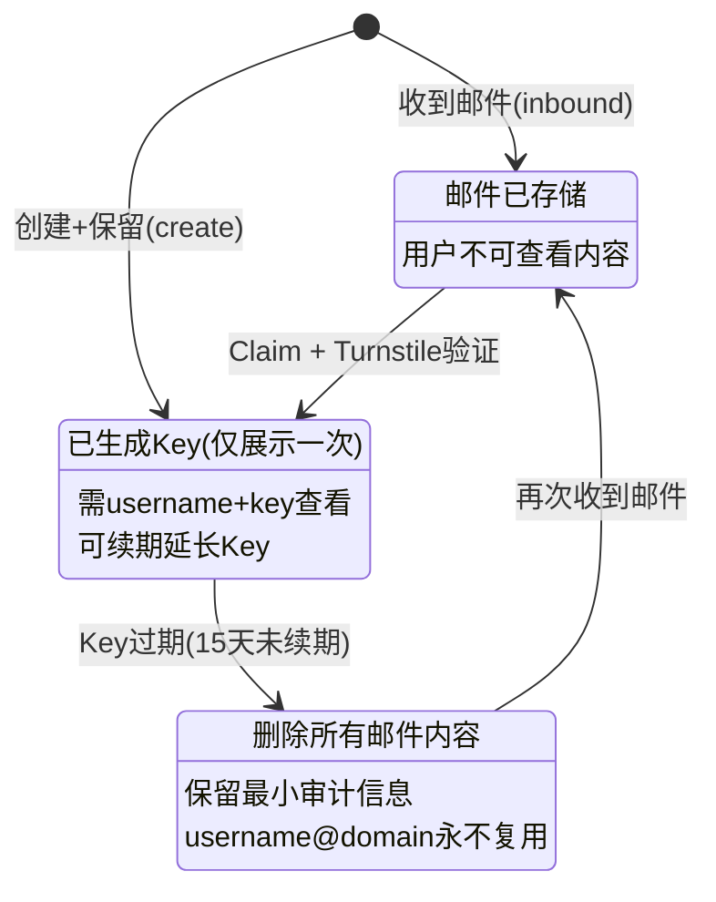

**状态转换规则**

| 转换 | 触发条件 | 结果 |
|------|----------|------|
| `[*]` -> `UNCLAIMED` | 首次收到邮件 (inbound) | 创建占位邮箱 |
| `[*]` -> `CLAIMED` | 用户创建并选择保留 | 生成 Key |
| `UNCLAIMED` -> `CLAIMED` | Claim + Turnstile | 生成 Key，有效期 15 天 |
| `CLAIMED` -> `DESTROYED` | Key 过期未续期 | 删除邮件，保留审计 |
| `DESTROYED` -> `UNCLAIMED` | 再次收到邮件 | 需重新认领 |

### 4.2 Key 状态机 (Key State Machine)

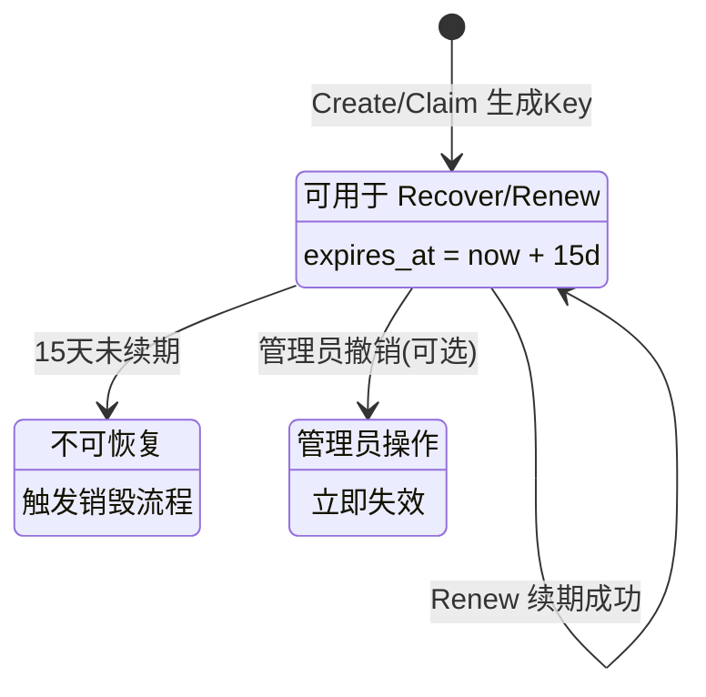

**Key 验证流程（恒定时间）**

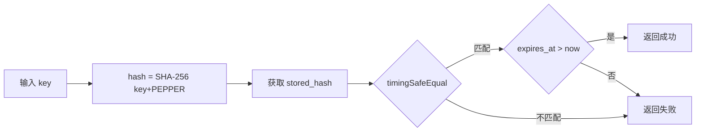

### 4.3 邮件处理流程 (Email Inbound Flow)

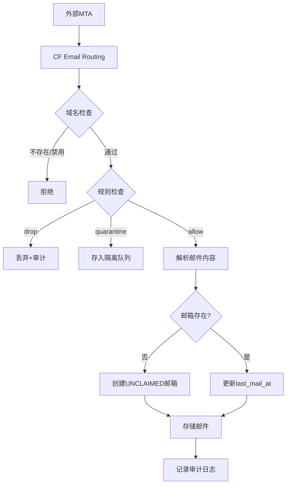

**处理步骤说明**

| 步骤 | 操作 | 失败处理 |
|------|------|----------|
| 1. 解析收件人 | `Envelope-To` -> `username@domain` | 拒绝 |
| 2. 域名检查 | 查询 `domains` 表，检查状态 | 拒绝 |
| 3. 规则检查 | 按 `priority` 顺序匹配规则 | DROP/QUARANTINE |
| 4. 解析内容 | 提取头/正文/附件元信息，净化HTML | 记录错误 |
| 5. 查找邮箱 | 不存在则创建 `UNCLAIMED` | - |
| 6. 存储邮件 | 插入 `messages` 表 | 记录错误 |
| 7. 审计日志 | 记录 `email_received` 事件 | - |

### 4.4 用户创建邮箱流程 (Create Mailbox Flow)

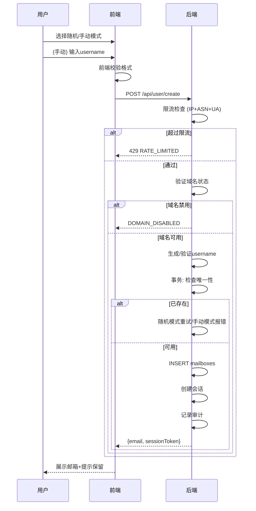

### 4.5 认领流程 (Claim Flow)

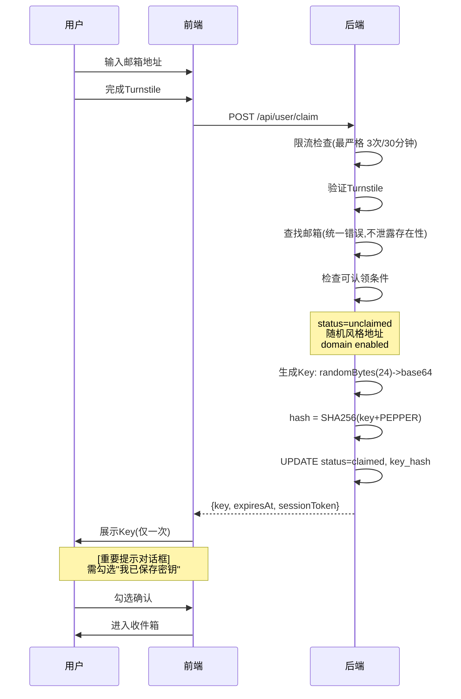

### 4.6 恢复与续期流程 (Recover & Renew Flow)

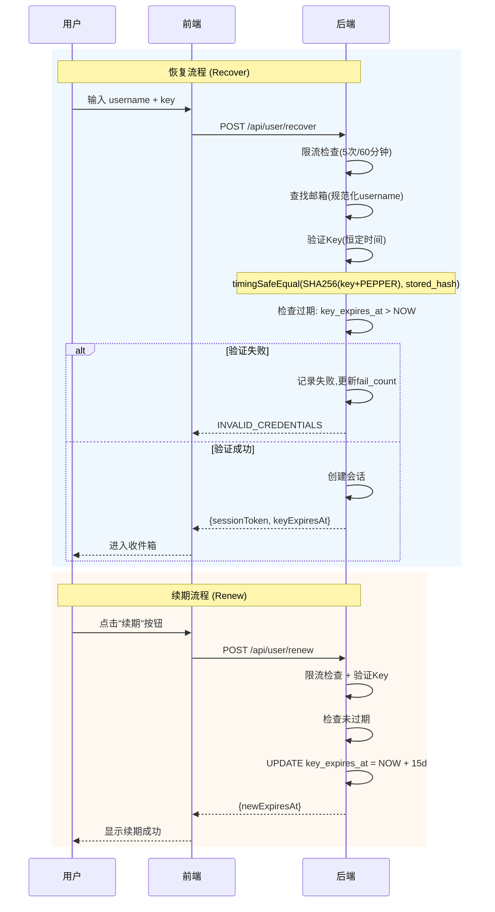

### 4.7 定时任务流程 (Scheduled Jobs)

| Job | 执行频率 | 操作 |
|-----|----------|------|
| **Key过期检查** | 每小时 | 查询 `status=claimed AND key_expires_at<NOW()` 的邮箱，删除邮件/会话，更新状态为 `destroyed` |
| **UNCLAIMED清理** | 每天 | 查询 `status=unclaimed AND created_at<NOW()-7d` 的邮箱，执行销毁 |
| **会话清理** | 每小时 | 删除 `sessions/admin_sessions` 中 `expires_at<NOW()` 的记录 |
| **限流清理** | 每小时 | 删除 `rate_limits` 中过期的窗口和冷却记录 |
| **统计聚合** | 每天 | 聚合昨日数据到 `stats_daily` |

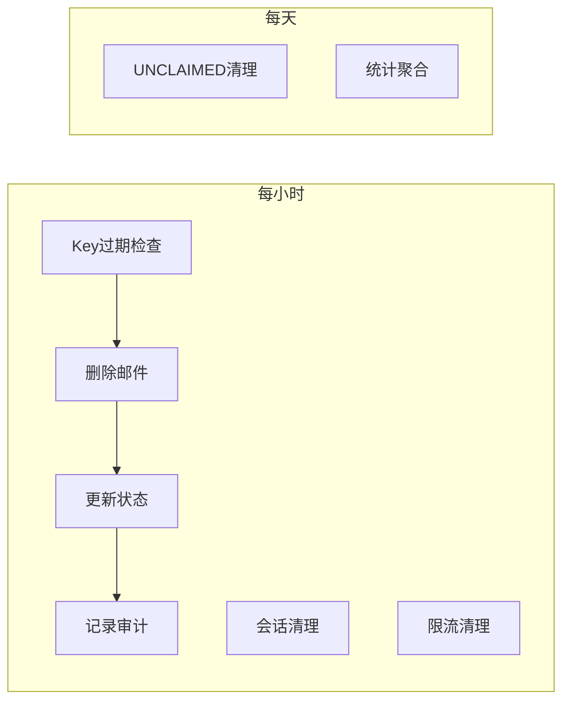

---

## 5. 前端页面设计

### 5.1 页面结构

| 路由 | 页面 | 认证 |
|------|------|------|
| `/` | 首页 (Create) | - |
| `/inbox` | 收件箱 | Session |
| `/inbox/:id` | 邮件详情 | Session |
| `/claim` | 认领页面 | - |
| `/recover` | 恢复页面 | - |
| `/admin` | 管理后台 | - |
| `/admin/login` | 管理员登录 | - |
| `/admin/dashboard` | 仪表盘 | Admin |
| `/admin/domains` | 域名管理 | Admin |
| `/admin/rules` | 规则管理 | Admin |
| `/admin/quarantine` | 隔离队列 | Admin |
| `/admin/audit` | 审计日志 | Admin |
| `/admin/settings` | 系统设置 | Admin |

### 5.2 UI 技术规范

**框架与组件库**
- 前端框架: Next.js 14+ (App Router)
- 用户端 UI: **MDUI 2**（严格遵循 Material Design 3）
- 管理端 UI: **TailAdmin + shadcn/ui**（Tailwind 体系）
- 样式方案: Tailwind CSS

**图标规范**
- 图标库: Iconify
- 用户端: `mdi` (Material Design Icons)
- 管理端: `lucide` (与 shadcn/ui 风格一致)
- 禁止: 使用 emoji 作为图标或装饰元素

**UI 框架分工**

| 区域 | 框架 | 用途 |
|------|------|------|
| 用户端 | MDUI 2 | 首页、收件箱、认领、恢复页面 |
| 管理端布局 | TailAdmin | 侧边栏、仪表盘布局、统计卡片、图表 |
| 管理端交互 | shadcn/ui | 表单、对话框、表格、按钮等交互组件 |

**页面组成要素**

| 页面 | 核心组件 | 图标使用 |
|------|----------|----------|
| 首页 | 模式切换、用户名输入、域名选择、创建按钮 | `mdi:dice-multiple` `mdi:pencil` |
| 收件箱 | 邮件列表、搜索栏、详情面板、视图切换 | `mdi:email` `mdi:magnify` |
| 认领/恢复 | 表单输入、Turnstile 组件、Key 展示对话框 | `mdi:key` `mdi:shield-check` |
| 管理后台 | 侧边导航、统计卡片、图表、数据表格 | `lucide:*` 系列 |

### 5.3 交互规范

**状态反馈**
- Loading: Spinner / Skeleton
- Success: Snackbar (绿色)
- Error: Snackbar (红色) + 详细提示
- Empty: 空状态插画 + 引导文字

**关键操作确认**
- Key 展示: 模态对话框 + 强制勾选确认
- 加载外部资源: 二次确认对话框
- 管理员敏感操作: 确认对话框

---

## 6. HTML 净化规则

### 6.1 净化策略

```typescript
interface SanitizeConfig {
  // 允许的标签白名单
  allowedTags: string[];
  
  // 允许的属性白名单 (按标签)
  allowedAttributes: Record<string, string[]>;
  
  // 完全移除的标签 (包括内容)
  stripTags: string[];
  
  // URL scheme 白名单
  allowedSchemes: string[];
  
  // 最大嵌套深度
  maxDepth: number;
  
  // 最大输出长度
  maxLength: number;
}

	const DEFAULT_SANITIZE_CONFIG: SanitizeConfig = {
	  allowedTags: [
	    // 结构
	    'div', 'span', 'p', 'br', 'hr',
    // 文本格式
    'b', 'i', 'u', 's', 'strong', 'em', 'mark', 'small', 'sub', 'sup',
    // 标题
    'h1', 'h2', 'h3', 'h4', 'h5', 'h6',
    // 列表
    'ul', 'ol', 'li', 'dl', 'dt', 'dd',
    // 表格
    'table', 'thead', 'tbody', 'tfoot', 'tr', 'th', 'td', 'caption',
    // 链接 (href 会被检查)
    'a',
	    // 图片 (默认替换为占位符)
	    'img',
	    // 样式（允许，但会过滤外链加载相关语法）
	    'style',
	    // 引用
	    'blockquote', 'pre', 'code',
	  ],
  
	  allowedAttributes: {
	    '*': ['class', 'id', 'style'],  // style 会被进一步过滤（移除 url()/@import/@font-face 等）
	    'a': ['href', 'title', 'target'],
	    'img': ['src', 'alt', 'width', 'height'],  // src 默认替换
	    'td': ['colspan', 'rowspan'],
	    'th': ['colspan', 'rowspan'],
	    'table': ['border', 'cellpadding', 'cellspacing'],
	  },
	  
	  // 完全移除 (含内容)
	  stripTags: [
	    'script', 'iframe', 'frame', 'frameset',
	    'object', 'embed', 'applet', 'form', 'input', 'button',
	    'select', 'textarea', 'meta', 'link', 'base',
	  ],
  
  allowedSchemes: ['http', 'https', 'mailto'],
  
  maxDepth: 50,
  maxLength: 500_000,  // 500KB
};
```

### 6.2 外部资源处理

```typescript
interface ExternalResourceHandler {
  // 图片处理
  handleImage(src: string): {
    type: 'placeholder' | 'proxy' | 'allow';
    replacement?: string;
  };
  
  // 链接处理
  handleLink(href: string): {
    type: 'sanitize' | 'remove';
    sanitizedHref?: string;
  };
}

// 默认：所有外部图片替换为占位符
// 用户可选择"加载外部资源"
```

---

## 7. CSP 配置

### 7.1 用户站点 CSP

```
Content-Security-Policy:
  default-src 'self';
  script-src 'self' https://challenges.cloudflare.com {UMAMI_DOMAIN};
  style-src 'self' 'unsafe-inline';
  img-src 'self' data: blob:;
  font-src 'self';
  connect-src 'self' https://challenges.cloudflare.com {UMAMI_DOMAIN};
  frame-src https://challenges.cloudflare.com;
  frame-ancestors 'none';
  base-uri 'self';
  form-action 'self';
```

### 7.2 管理后台 CSP (更严格)

```
Content-Security-Policy:
  default-src 'self';
  script-src 'self' {UMAMI_DOMAIN};
  style-src 'self' 'unsafe-inline';
  img-src 'self' data:;
  font-src 'self';
  connect-src 'self' {UMAMI_DOMAIN};
  frame-src 'none';
  frame-ancestors 'none';
  base-uri 'self';
  form-action 'self';
```

### 7.3 其他安全头

```
X-Content-Type-Options: nosniff
X-Frame-Options: DENY
X-XSS-Protection: 0
Referrer-Policy: no-referrer  (管理后台)
Referrer-Policy: strict-origin-when-cross-origin  (用户站点)
Permissions-Policy: camera=(), microphone=(), geolocation=()
```

---
