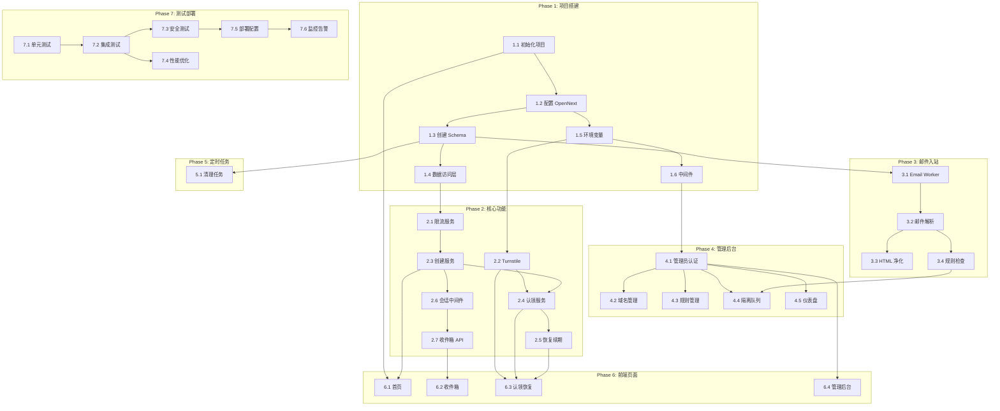

# FlashInbox / 闪收箱 任务清单

> 基于 01spec.md 需求规格和 02design.md 设计文档，本文档定义详细的开发任务和验收标准。

---

## 任务总览

| 阶段 | 任务数 | 预估工时 | 说明 |
|------|--------|----------|------|
| Phase 1: 项目搭建 | 6 | 2-3 天 | 基础设施、项目结构、数据库 |
| Phase 2: 核心功能 | 7 | 5-7 天 | 邮箱创建、认领、恢复、收件箱 |
| Phase 3: 邮件入站 | 4 | 3-4 天 | Email Worker、解析、存储 |
| Phase 4: 管理后台 | 5 | 3-4 天 | 域名、规则、隔离、审计 |
| Phase 5: 定时任务 | 1 | 3h | 过期清理、统计聚合 |
| Phase 6: 前端页面 | 4 | 4-5 天 | 用户端 MDUI / 管理端 TailAdmin + shadcn/ui |
| Phase 7: 测试部署 | 6 | 2-3 天 | 测试、优化、部署 |

**总计：33 个任务，预估 20-27 天**

---

## Phase 1: 项目搭建与基础设施

### Task 1.1: 初始化 Next.js 项目

| 属性 | 值 |
|------|------|
| 优先级 | P0 |
| 预估工时 | 2h |
| 前置依赖 | 无 |

**任务描述**

创建 Next.js 14+ 项目，配置 App Router 和 Edge Runtime。

**实现要点**
- 使用 `bunx create-next-app` 初始化
- 配置 TypeScript 严格模式
- 安装 MDUI、Tailwind CSS、Iconify、shadcn/ui
- 设置项目目录结构（见 AGENTS.md）

**验收标准**
- [x] `bun run dev` 能够启动开发服务器
- [x] TypeScript 编译无错误
- [x] ESLint 检查通过
- [x] 目录结构符合设计文档规划
- [x] MDUI 组件能够正常渲染

**测试要点**
- [x] 首页能够访问并显示 MDUI 组件
- [x] 热更新功能正常
- [x] 构建产物不包含警告

---

### Task 1.2: 配置 OpenNext 与 Cloudflare

| 属性 | 值 |
|------|------|
| 优先级 | P0 |
| 预估工时 | 3h |
| 前置依赖 | Task 1.1 |

**任务描述**

配置 OpenNext 适配器，使 Next.js 能够部署到 Cloudflare Workers。

**实现要点**
- 安装 `@opennextjs/cloudflare`
- 配置 `wrangler.toml`
- 配置 D1 数据库绑定
- 配置环境变量

**验收标准**
- [x] `wrangler dev` 能够启动本地开发服务器
- [x] 能够访问 D1 数据库绑定
- [x] 环境变量正确注入
- [x] `wrangler deploy` 能够成功部署

**测试要点**
- [x] API 路由在 Workers 环境下能够正常响应
- [x] 环境变量 `DEFAULT_DOMAIN` 可读取
- [x] D1 绑定 `DB` 可执行查询

---

### Task 1.3: 创建数据库 Schema

| 属性 | 值 |
|------|------|
| 优先级 | P0 |
| 预估工时 | 2h |
| 前置依赖 | Task 1.2 |

**任务描述**

在 D1 中创建所有必要的数据表（参考 02design.md 2.2 节）。

**实现要点**
- 创建 `migrations/0001_init.sql`
- 定义 10 张表结构
- 创建必要索引
- 添加外键约束和 CHECK 约束

**验收标准**
- [x] 所有表创建成功
- [x] 索引创建成功
- [x] 外键约束生效
- [x] CHECK 约束生效（如 status 枚举值）
- [x] 可执行基本 CRUD 操作

**测试要点**
- [x] 插入违反约束的数据应失败
- [x] 索引查询性能符合预期
- [x] 级联删除正常工作

---

### Task 1.4: 实现数据库访问层

| 属性 | 值 |
|------|------|
| 优先级 | P0 |
| 预估工时 | 4h |
| 前置依赖 | Task 1.3 |

**任务描述**

创建类型安全的数据库访问层（Repository 模式）。

**实现要点**
- 定义所有 TypeScript 实体类型
- 创建 Repository 基类
- 实现各实体的 Repository（Mailbox、Message、Domain、Rule 等）
- 实现行映射（snake_case -> camelCase）

**验收标准**
- [x] 所有 Repository 类实现完成
- [x] TypeScript 类型正确
- [x] 查询结果类型安全
- [x] 支持 null 字段正确处理

**测试要点**
- [x] `MailboxRepository.findById()` 返回正确类型
- [x] `MailboxRepository.create()` 插入并返回新记录
- [x] 不存在的记录返回 `null`

---

### Task 1.5: 实现环境变量与配置管理

| 属性 | 值 |
|------|------|
| 优先级 | P0 |
| 预估工时 | 1h |
| 前置依赖 | Task 1.2 |

**任务描述**

创建类型安全的环境变量访问和配置管理。

**实现要点**
- 定义 `Env` 接口（所有环境变量）
- 创建 `getEnv()` 配置加载函数
- 设置默认值
- 区分 Secrets 和 Vars

**验收标准**
- [x] 环境变量类型安全
- [x] 默认值正确设置
- [x] 必需变量缺失时报错

**测试要点**
- [x] `KEY_EXPIRE_DAYS` 默认值为 15
- [x] 缺少 `ADMIN_TOKEN` 时应报错
- [x] `getEnv()` 返回类型正确

---

### Task 1.6: 配置中间件架构

| 属性 | 值 |
|------|------|
| 优先级 | P0 |
| 预估工时 | 2h |
| 前置依赖 | Task 1.5 |

**任务描述**

创建 Next.js 中间件，处理安全头、CSP 等横切关注点。

**实现要点**
- 配置 `middleware.ts`
- 添加安全头（X-Content-Type-Options、X-Frame-Options 等）
- 实现 CSP 策略（用户站点/管理后台区分）
- 管理后台设置 `Referrer-Policy: no-referrer`

**验收标准**
- [x] 中间件正确拦截 `/api/*` 和 `/admin/*`
- [x] 安全头正确设置
- [x] CSP 策略生效
- [x] 管理后台 Referrer-Policy 为 no-referrer

**测试要点**
- [x] 响应头包含所有安全头
- [x] CSP 阻止内联脚本执行
- [x] 管理后台页面不发送 Referrer

---

## Phase 2: 核心功能开发

### Task 2.1: 实现限流服务

| 属性 | 值 |
|------|------|
| 优先级 | P0 |
| 预估工时 | 3h |
| 前置依赖 | Task 1.4 |

**任务描述**

实现基于 IP+ASN+UA 的多维度限流，支持固定窗口和指数退避。

**实现要点**
- 实现 `RateLimitService` 类
- 支持不同动作的限流配置
- 实现冷却时间计算
- 实现指数退避（针对 Recover）

**验收标准**
- [x] 限流计数正确
- [x] 冷却时间生效
- [x] 指数退避正确计算（2^n 倍增）
- [x] 多维度 key 生成正确

**测试要点**
- [x] 连续 10 次 create 后第 11 次被限流
- [x] 限流后等待冷却时间可恢复
- [x] Recover 失败 5 次后冷却时间为 60 分钟

---

### Task 2.2: 实现 Turnstile 验证服务

| 属性 | 值 |
|------|------|
| 优先级 | P0 |
| 预估工时 | 2h |
| 前置依赖 | Task 1.5 |

**任务描述**

实现 Cloudflare Turnstile 人机验证的后端验证和前端组件。

**实现要点**
- 实现 `TurnstileService.verify()` 后端验证
- 创建 `<Turnstile />` React 组件
- 处理验证失败情况

**验收标准**
- [x] 后端验证成功/失败正确处理
- [x] 前端组件正确渲染
- [x] 验证成功后 token 传递正确
- [x] 错误处理完善

**测试要点**
- [x] 有效 token 验证返回 true
- [x] 无效 token 验证返回 false
- [x] 网络错误时安全降级

---

### Task 2.3: 实现邮箱创建服务

| 属性 | 值 |
|------|------|
| 优先级 | P0 |
| 预估工时 | 4h |
| 前置依赖 | Task 2.1 |

**任务描述**

实现邮箱创建服务，支持随机生成和手动指定。

**实现要点**
- 实现 `MailboxService.create()`
- 实现随机用户名生成（词库组合）
- 实现用户名规范化和验证
- 实现唯一性检查和并发安全
- 创建 `/api/user/create` API 路由

**验收标准**
- [x] 随机创建正确生成唯一用户名
- [x] 手动创建验证用户名格式
- [x] 并发创建不会产生冲突
- [x] 会话正确创建
- [x] 限流正确触发

**测试要点**
- [x] 100 次并发创建不会产生重复
- [x] 无效用户名（如 "ab"）被拒绝
- [x] 已存在的用户名手动创建失败

---

### Task 2.4: 实现邮箱认领服务

| 属性 | 值 |
|------|------|
| 优先级 | P0 |
| 预估工时 | 4h |
| 前置依赖 | Task 2.2, Task 2.3 |

**任务描述**

实现邮箱认领服务，将 UNCLAIMED 邮箱转为 CLAIMED 并生成 Key。

**实现要点**
- 实现 `MailboxService.claim()`
- 验证邮箱状态和可认领条件
- 生成 Key 并哈希存储
- 创建 `/api/user/claim` API 路由
- 强制 Turnstile 验证

**验收标准**
- [x] 只能认领 UNCLAIMED 状态的邮箱
- [x] Turnstile 验证必须通过
- [x] Key 正确生成（32 字符）并哈希存储
- [x] 状态转换为 CLAIMED
- [x] 手动创建的地址不能被 claim

**测试要点**
- [x] 认领 CLAIMED 邮箱返回错误
- [x] 认领 manual 类型邮箱返回错误
- [x] Key 在数据库中是哈希值而非明文

---

### Task 2.5: 实现恢复与续期服务

| 属性 | 值 |
|------|------|
| 优先级 | P0 |
| 预估工时 | 4h |
| 前置依赖 | Task 2.4 |

**任务描述**

实现 Key 恢复访问和续期功能。

**实现要点**
- 实现 `MailboxService.recover()`
- 实现 `MailboxService.renew()`
- Key 验证使用恒定时间比较
- 统一错误响应（不泄露信息）
- 创建 `/api/user/recover` 和 `/api/user/renew` API 路由

**验收标准**
- [x] Key 验证使用恒定时间比较
- [x] 错误信息不泄露邮箱/key 状态
- [x] 续期正确更新过期时间
- [x] 过期 Key 不能续期
- [x] 失败触发指数退避

**测试要点**
- [x] 错误的 Key 返回 `INVALID_CREDENTIALS`
- [x] 不存在的邮箱返回相同错误（不区分）
- [x] 续期后 `key_expires_at` 更新为 now + 15d

---

### Task 2.6: 实现会话认证中间件

| 属性 | 值 |
|------|------|
| 优先级 | P0 |
| 预估工时 | 2h |
| 前置依赖 | Task 2.3 |

**任务描述**

实现会话验证服务和认证中间件。

**实现要点**
- 实现 `SessionService.verify()`
- 实现 `withAuth()` 高阶函数
- 会话过期检查
- 邮箱状态检查

**验收标准**
- [x] Bearer token 正确解析
- [x] 过期会话正确拒绝
- [x] 邮箱状态检查正确
- [x] 会话最后访问时间更新

**测试要点**
- [x] 无 Authorization 头返回 401
- [x] 过期 token 返回 `SESSION_EXPIRED`
- [x] 邮箱被销毁后会话失效

---

### Task 2.7: 实现收件箱 API

| 属性 | 值 |
|------|------|
| 优先级 | P0 |
| 预估工时 | 3h |
| 前置依赖 | Task 2.6 |

**任务描述**

实现收件箱列表和邮件详情 API。

**实现要点**
- 实现 `MessageService.getInbox()`
- 实现 `MessageService.getDetail()`
- 支持分页、搜索、未读筛选
- 自动标记已读
- 创建 `/api/mailbox/inbox` 和 `/api/mailbox/message/:id` API 路由

**验收标准**
- [x] 分页正确工作
- [x] 搜索功能正常（主题/发件人）
- [x] 只返回当前邮箱的邮件
- [x] 自动标记已读
- [x] 限流正确触发

**测试要点**
- [x] `page=2&pageSize=10` 返回第二页数据
- [x] 搜索 "github" 返回匹配邮件
- [x] 访问详情后 `read_at` 字段更新

---

## Phase 3: 邮件入站处理

### Task 3.1: 实现 Email Worker

| 属性 | 值 |
|------|------|
| 优先级 | P0 |
| 预估工时 | 4h |
| 前置依赖 | Task 1.3 |

**任务描述**

创建 Cloudflare Email Worker 接收和处理入站邮件。

**实现要点**
- 创建 `src/workers/email/index.ts`
- 解析收件人地址
- 域名状态检查
- 调用规则检查、邮件解析、存储等模块

**验收标准**
- [x] 能接收入站邮件
- [x] 正确解析收件人
- [x] 域名检查生效（disabled 域名拒绝）
- [x] 邮件正确存储
- [x] 审计日志记录

**测试要点**
- [x] 发送到未知域名的邮件被拒绝
- [x] 发送到 disabled 域名的邮件被拒绝
- [x] 发送到新地址自动创建 UNCLAIMED 邮箱

---

### Task 3.2: 实现邮件解析器

| 属性 | 值 |
|------|------|
| 优先级 | P0 |
| 预估工时 | 4h |
| 前置依赖 | Task 3.1 |

**任务描述**

实现邮件内容解析，提取头信息、正文和附件元信息。

**实现要点**
- 使用 `mailparser` 库
- 提取所有必要头字段
- 提取 text/plain 和 text/html
- 记录附件元信息（不存储内容）
- 应用截断策略

**验收标准**
- [x] 正确解析邮件头（From, Subject, Date 等）
- [x] 正确提取纯文本和 HTML
- [x] 附件信息提取正确
- [x] 超长内容正确截断
- [x] 截断标志正确设置

**测试要点**
- [x] 解析含附件邮件，`has_attachments` 为 true
- [x] 100KB 以上的正文被截断
- [x] `text_truncated` 标志正确

---

### Task 3.3: 实现 HTML 净化器

| 属性 | 值 |
|------|------|
| 优先级 | P0 |
| 预估工时 | 3h |
| 前置依赖 | Task 3.2 |

**任务描述**

实现 HTML 内容净化，移除危险标签和属性。

**实现要点**
- 使用 DOMPurify
- 配置允许的标签和属性白名单
- 移除脚本和事件属性
- 替换外部图片为占位符
- 过滤危险 URL scheme

**验收标准**
- [x] `` 被完全移除
- [x] `` 被替换为占位符
- [x] `<a href="javascript:alert(1)">` 的 href 被移除

---

### Task 3.4: 实现规则检查器

| 属性 | 值 |
|------|------|
| 优先级 | P0 |
| 预估工时 | 3h |
| 前置依赖 | Task 3.2 |

**任务描述**

实现邮件规则检查，支持 DROP/QUARANTINE/ALLOW。

**实现要点**
- 实现 `checkRules()` 函数
- 按优先级顺序匹配规则
- 支持 sender_domain、sender_addr、keyword、ip 类型
- 更新规则命中计数

**验收标准**
- [x] 规则按优先级执行
- [x] 发件人域名匹配正确
- [x] 关键词匹配正确（主题/正文）
- [x] 命中计数更新
- [x] DROP 不存储邮件
- [x] QUARANTINE 存入隔离队列

**测试要点**
- [x] 优先级 10 的规则先于优先级 100 执行
- [x] 命中 DROP 规则后邮件不存入 messages
- [x] 命中 QUARANTINE 规则后邮件存入 quarantine

---

## Phase 4: 管理后台

### Task 4.1: 实现管理员认证

| 属性 | 值 |
|------|------|
| 优先级 | P0 |
| 预估工时 | 3h |
| 前置依赖 | Task 1.6 |

**任务描述**

实现管理员登录、会话管理和认证中间件。

**实现要点**
- 实现 `AdminAuthService.login()`
- Token 验证使用恒定时间比较
- 创建管理员会话
- 实现 `withAdminAuth()` 中间件
- 记录浏览器指纹

**验收标准**
- [x] Token 验证使用恒定时间比较
- [x] 会话正确创建（4 小时有效期）
- [x] 登出正确删除会话
- [x] 限流正确触发
- [x] 审计日志记录

**测试要点**
- 错误 token 返回 `ADMIN_UNAUTHORIZED`
- 登录成功返回 `sessionId` 和 `sessionToken`
- 连续 5 次失败后触发 120 分钟冷却

---

### Task 4.2: 实现域名管理 API

| 属性 | 值 |
|------|------|
| 优先级 | P1 |
| 预估工时 | 3h |
| 前置依赖 | Task 4.1 |

**任务描述**

实现域名 CRUD API。

**实现要点**
- GET /api/admin/domains - 获取列表（含邮箱计数）
- POST /api/admin/domains - 添加域名
- PUT /api/admin/domains/:id - 更新状态/备注
- DELETE /api/admin/domains/:id - 删除域名
- 记录审计日志

**验收标准**
- [x] 域名 CRUD 操作正常
- [x] 状态切换正确（enabled/disabled/readonly）
- [x] 重复域名添加失败
- [x] 审计日志记录

**测试要点**
- 添加重复域名返回错误
- 删除有邮箱的域名需确认
- 状态变更记录审计日志

---

### Task 4.3: 实现规则管理 API

| 属性 | 值 |
|------|------|
| 优先级 | P1 |
| 预估工时 | 3h |
| 前置依赖 | Task 4.1 |

**任务描述**

实现规则 CRUD API。

**实现要点**
- GET /api/admin/rules - 获取列表（含命中计数）
- POST /api/admin/rules - 添加规则
- PUT /api/admin/rules/:id - 更新规则
- DELETE /api/admin/rules/:id - 删除规则
- 支持全局/域名级别规则

**验收标准**
- [x] 规则 CRUD 操作正常
- [x] 优先级排序正确
- [x] 命中计数显示
- [x] 支持启用/禁用切换

**测试要点**
- 规则列表按 priority 排序
- 禁用规则不参与匹配
- 新规则默认 priority 为 100

---

### Task 4.4: 实现隔离队列管理

| 属性 | 值 |
|------|------|
| 优先级 | P1 |
| 预估工时 | 3h |
| 前置依赖 | Task 4.1, Task 3.4 |

**任务描述**

实现隔离邮件查看、释放和删除。

**实现要点**
- GET /api/admin/quarantine - 获取列表
- POST /api/admin/quarantine/:id/release - 释放到正常邮箱
- DELETE /api/admin/quarantine/:id - 永久删除
- 显示匹配的规则信息

**验收标准**
- [x] 隔离邮件列表正确
- [x] 释放操作正确转移邮件到 messages 表
- [x] 删除操作正确清理
- [x] 显示命中规则名称

**测试要点**
- 释放后邮件出现在用户收件箱
- 释放后 quarantine 状态变为 released
- 删除后记录完全移除

---

### Task 4.5: 实现数据仪表盘 API

| 属性 | 值 |
|------|------|
| 优先级 | P2 |
| 预估工时 | 4h |
| 前置依赖 | Task 4.1 |

**任务描述**

实现仪表盘数据统计 API。

**实现要点**
- GET /api/admin/dashboard - 获取统计数据
- 支持时间范围筛选（24h/7d/30d）
- 概览数据（邮箱数、邮件数、隔离数）
- 时间序列数据（邮件接收趋势）
- 安全指标（限流触发、Turnstile 失败等）

**验收标准**
- [x] 概览数据正确
- [x] 时间序列数据正确
- [x] 规则命中统计正确
- [x] 支持不同时间范围

**测试要点**
- 24h 数据与实际一致
- 时间序列数据点数正确
- 安全指标计数准确

---

## Phase 5: 定时任务

### Task 5.1: 实现定时清理任务

| 属性 | 值 |
|------|------|
| 优先级 | P0 |
| 预估工时 | 3h |
| 前置依赖 | Task 1.3 |

**任务描述**

实现 Scheduled Workers，执行过期清理和统计聚合。

**实现要点**
- Key 过期检查与销毁（每小时）
- UNCLAIMED 邮箱清理（每天）
- 会话清理（每小时）
- 限流记录清理（每小时）
- 统计数据聚合（每天）

**验收标准**
- [x] 过期 Key 正确检测
- [x] 邮件内容正确删除
- [x] 邮箱状态正确更新为 DESTROYED
- [x] 会话/限流记录正确清理
- [x] 统计数据正确聚合

**测试要点**
- Key 过期后邮箱状态变为 destroyed
- 邮件内容被删除，审计日志保留
- 7 天未认领的邮箱被清理

---

## Phase 6: 前端页面

### Task 6.1: 实现首页

| 属性 | 值 |
|------|------|
| 优先级 | P0 |
| 预估工时 | 4h |
| 前置依赖 | Task 1.1, Task 2.3 |

**任务描述**

实现首页，包括随机/手动创建邮箱功能。

**实现要点**
- 模式切换（随机/手动）
- 用户名输入和格式验证
- 域名选择器
- 创建按钮和 Loading 状态
- 创建成功后跳转到收件箱
- 使用 MDUI 2 组件（严格 MD3）和 Iconify mdi 图标集

**验收标准**
- [x] 随机创建流程完整
- [x] 手动创建流程完整
- [x] 格式验证反馈正确
- [x] 错误处理正确
- [x] 响应式布局正常
- [x] 禁止使用 emoji

**测试要点**
- 输入 "ab" 提示长度不足
- 随机创建成功后跳转收件箱
- 限流时显示冷却时间

---

### Task 6.2: 实现收件箱页面

| 属性 | 值 |
|------|------|
| 优先级 | P0 |
| 预估工时 | 5h |
| 前置依赖 | Task 2.7 |

**任务描述**

实现收件箱列表和邮件详情页面，使用 MDUI 2（严格 MD3）。

**实现要点**
- 邮件列表组件（发件人、主题、时间、已读状态）
- 搜索和筛选功能
- 分页组件
- 邮件详情面板
- 纯文本/HTML 视图切换
- 外部资源加载开关
- 使用 MDUI 2 组件和 Iconify mdi 图标集

**验收标准**
- [x] 邮件列表正确显示
- [x] 邮件详情正确显示
- [x] 纯文本/HTML 切换正确
- [x] 外部资源默认不加载
- [x] 搜索和分页正常工作

**测试要点**
- 未读邮件有明显标识
- 切换 HTML 视图时脚本不执行
- 点击"加载外部资源"后图片显示

---

### Task 6.3: 实现认领/恢复页面

| 属性 | 值 |
|------|------|
| 优先级 | P0 |
| 预估工时 | 3h |
| 前置依赖 | Task 2.2, Task 2.4, Task 2.5 |

**任务描述**

实现认领页面和恢复页面，使用 MDUI 2（严格 MD3）。

**实现要点**
- 认领：邮箱输入 + Turnstile
- 恢复：username + key 输入
- Key 展示对话框（仅一次，需勾选确认）
- 续期按钮和反馈
- 错误提示
- 使用 MDUI 2 组件和 Iconify mdi 图标集

**验收标准**
- [x] Turnstile 集成正确
- [x] Key 展示正确（仅一次）
- [x] 恢复流程完整
- [x] 续期反馈正确
- [x] 强制勾选"我已保存密钥"

**测试要点**
- Turnstile 验证失败时无法提交
- Key 对话框关闭后无法再次查看
- 恢复失败显示统一错误（不泄露信息）

---

### Task 6.4: 实现管理后台页面

| 属性 | 值 |
|------|------|
| 优先级 | P1 |
| 预估工时 | 6h |
| 前置依赖 | Task 4.1 - 4.5 |

**任务描述**

实现管理后台所有页面，使用 TailAdmin（布局/图表）+ shadcn/ui（交互组件）。

**实现要点**
- 登录页面（Token 输入，shadcn/ui 表单）
- 仪表盘页面（TailAdmin 统计卡片、图表）
- 域名管理页面（shadcn/ui 表格、对话框）
- 规则管理页面（shadcn/ui 表单）
- 隔离队列页面（释放/删除操作）
- 审计日志页面（筛选、分页）
- URL 自动追加追踪参数（ts/fp/sid）
- 图标统一使用 Iconify lucide 图标集

**验收标准**
- [ ] 登录流程正确
- [ ] URL 追踪参数正确
- [ ] 所有管理功能可用
- [ ] TailAdmin 布局 + shadcn/ui 组件集成正确
- [ ] 响应式布局正常
- [ ] 图标使用 lucide 图标集

**测试要点**
- 登录成功后 URL 包含 ts/fp/sid
- Token 不出现在 URL 中
- 所有 CRUD 操作有成功反馈

---

## Phase 7: 测试与部署

### Task 7.1: 单元测试

| 属性 | 值 |
|------|------|
| 优先级 | P1 |
| 预估工时 | 4h |
| 前置依赖 | Phase 1-4 |

**测试覆盖**
- 工具函数测试（crypto、username、response）
- 服务层测试（MailboxService、MessageService）
- 规则匹配测试
- HTML 净化测试

**验收标准**
- [x] 核心函数测试覆盖率 > 80%
- [x] 所有测试通过
- [x] 测试运行时间 < 30s

---

### Task 7.2: 集成测试

| 属性 | 值 |
|------|------|
| 优先级 | P1 |
| 预估工时 | 4h |
| 前置依赖 | Task 7.1 |

**测试覆盖**
- API 端到端测试
- 邮件处理流程测试
- 状态转换测试
- 限流集成测试

**验收标准**
- [x] 所有 API 端点测试通过
- [x] 邮件处理流程完整
- [x] 状态机转换正确

---

### Task 7.3: 安全测试

| 属性 | 值 |
|------|------|
| 优先级 | P0 |
| 预估工时 | 3h |
| 前置依赖 | Task 7.2 |

**测试覆盖**
- 限流有效性测试
- 恒定时间比较验证
- 信息泄露检查
- XSS 防护测试
- CSP 策略测试

**验收标准**
- [x] 限流正确阻止暴力破解
- [x] Key 验证时间恒定（误差 < 5%）
- [x] 错误响应不泄露敏感信息
- [x] HTML 净化阻止 XSS
- [x] CSP 阻止内联脚本

---

### Task 7.4: 性能优化

| 属性 | 值 |
|------|------|
| 优先级 | P2 |
| 预估工时 | 2h |
| 前置依赖 | Task 7.2 |

**优化点**
- 数据库查询优化
- 索引使用检查
- 响应时间监控
- 边缘缓存配置

**验收标准**
- [x] API 平均响应时间 < 200ms
- [x] 数据库查询使用索引
- [x] 无 N+1 查询问题

---

### Task 7.5: 部署配置

| 属性 | 值 |
|------|------|
| 优先级 | P0 |
| 预估工时 | 2h |
| 前置依赖 | Task 7.3 |

**配置项**
- 生产环境变量配置
- D1 数据库创建
- Email Routing 配置
- Scheduled Workers 配置
- 域名 DNS 配置

**验收标准**
- [ ] 所有 Secrets 配置正确
- [ ] D1 数据库已创建并迁移
- [ ] Email Routing 能接收邮件
- [ ] Cron 触发器已配置
- [ ] 自定义域名可访问

---

### Task 7.6: 监控告警

| 属性 | 值 |
|------|------|
| 优先级 | P2 |
| 预估工时 | 2h |
| 前置依赖 | Task 7.5 |

**配置项**
- Umami 集成
- 错误日志收集
- 关键指标告警

**验收标准**
- [ ] Umami 正常采集 PV
- [ ] 事件埋点不含敏感信息
- [ ] 错误日志可查看
- [ ] Recover 失败率告警配置

---

## 附录：任务依赖图

